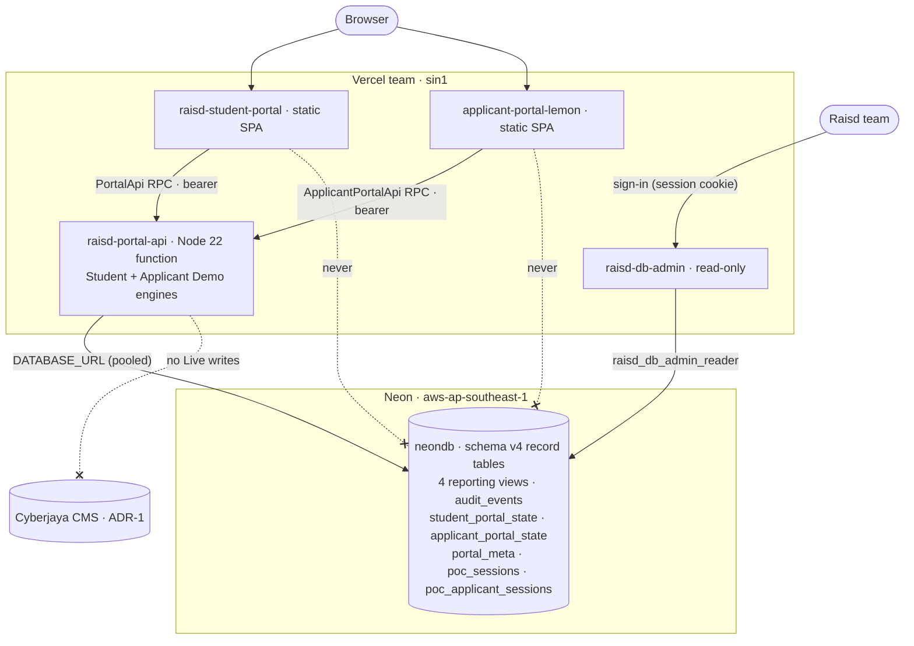

# PoC — Vercel frontend + Portal API + Neon PostgreSQL

**Status:** Demo — four portal webs, Portal API, Neon and a read-only DB admin deployed (28–29 September 2026). Acceptance checks: [portal-api-poc-requirements.md](../backend/portal-api-poc-requirements.md).  
**Published page:** https://raisd-campus.github.io/portal-api-docs/poc/vercel-neon.html (public endpoints: https://raisd-campus.github.io/portal-api-docs/diagrams/index.html#endpoints).  
**Does not replace:** production hosting in [deployment.md](deployment.md) / [SDD-12](../../sdd/12-deployment-architecture.md) (**ADR-2** UltaHost Singapore, **ADR-3** k3s).

This note is a **proof-of-concept path**. It is not an ADR and must not be presented as Live campus architecture. Production remains UltaHost + k3s; the existing CMS stays the system of record for Live writes ([ADR-1](overview.md#adr-1--existing-cms-as-initial-backend-this-phase)).

## Live targets

| Component | URL | Repo | Runtime | Deploy path |
|---|---|---|---|---|
| Student portal | https://raisd-student-portal.vercel.app | `student-portal` | Vite + React SPA, static prebuilt output | GitHub Actions `CI/CD` on push to `main` |
| Applicant portal | https://applicant-portal-lemon.vercel.app | `applicant-portal` | Vite + React SPA, HTTP Portal API when `VITE_PORTAL_API_URL` is set | Manual prebuilt deploy (Actions billing may block CI); same `CI/CD` template as other portals |
| Lecturer portal | https://raisd-lecturer-portal.vercel.app | `lecturer-portal` | "Coming soon" placeholder | GitHub Actions `CI/CD` on push to `main` |
| Staff portal | https://raisd-staff-portal.vercel.app | `staff-portal` | "Coming soon" placeholder | GitHub Actions `CI/CD` on push to `main` |
| Portal API | https://raisd-portal-api.vercel.app | `portal-api` | Fastify in one Node 22 Vercel Function, `sin1`, 30 s max | Manual `npm run deploy:vercel` (CI runs checks only) |
| Database | no public URL | — | Neon Postgres 18, `aws-ap-southeast-1`, database `neondb` | Vercel Neon integration on the portal-api project |
| DB admin | https://raisd-db-admin.vercel.app (team only) | `db-admin` | Vercel Functions, `sin1`, read-only browser + SQL + ERD (CMS/LMS/shared colours) | Manual `npm run deploy` (no CI/CD) |
| Docs & OpenAPI | https://raisd-campus.github.io/portal-api-docs/ | `portal-api-docs` | GitHub Pages, site password | GitHub Actions `Pages` on push to `main` |

All Vercel projects are in one team and **not Git-connected**; every deploy is prebuilt output (`vercel deploy --prebuilt --prod`) from a workflow or a local checkout.

## Target deployment

Portals **never** talk to Postgres or the CMS. Only the Portal API (and the read-only DB admin) hold a connection string.



| Vercel project | Output | Env (names only) |
|---|---|---|
| `student-portal` | `npm run build:vercel` → `.vercel/output/static`; `/assets/*` immutable, missing chunk → 404, else `index.html` | `VITE_PORTAL_API_URL` (build fails if unset) |
| `applicant-portal` | `npm run build` → `dist/` packaged by the workflow with SPA fallback | `VITE_PORTAL_API_URL` |
| `lecturer-portal`, `staff-portal` | Generated placeholder until a `package.json` exists | — |
| `portal-api` | `scripts/build-vercel.mjs` bundles `src/vercel.ts` + student-portal and applicant-portal Demo engines into `functions/index.func` | `DATABASE_URL`, `DATABASE_URL_UNPOOLED`, `PG*`/`POSTGRES_*` (integration), `CORS_ORIGIN`; student and applicant demo passwords inlined at build from gitignored credentials |
| `db-admin` | Zero-build functions `api/*.ts` + `public/` | `DATABASE_URL` (reader), `DB_ADMIN_USER`, `DB_ADMIN_PASSWORD` |

`CORS_ORIGIN` = `https://raisd-student-portal.vercel.app,https://applicant-portal-lemon.vercel.app,https://raisd-campus.github.io`. Add an origin before another portal calls the API from a browser.

## CI/CD pipelines

| Repo · workflow | Triggers | Checks | Deploy | Configuration |
|---|---|---|---|---|
| Portal repos · `CI/CD` (`.github/workflows/ci-cd.yml`, canonical `control-plane/scripts/templates/portal-ci-cd.yml`) | PR, push to `main`, manual | Node from `.nvmrc` (22); `npm ci` via GitHub Packages; `lint`/`test`/`build` if present | `main` only: `build:vercel` if defined, else `build` + SPA packaging, else placeholder; `vercel@60 deploy --prebuilt --prod` | Secret `VERCEL_TOKEN`; vars `VERCEL_ORG_ID`, `VERCEL_PROJECT_ID`, `VITE_PORTAL_API_URL`; design-system package grants Actions read |
| `portal-api` · `CI` | PR, push to `main` | Checks out portal-api + student-portal + control-plane; `npm ci`; `docs:check`; boot with throwaway passwords + `scripts/smoke.sh` (health, meta, login, wrong password 401, portal call, logout revokes) | None — manual `npm run deploy:vercel` (needs sibling student-portal + gitignored credentials) | Secret `RAISD_READ_TOKEN` |
| `portal-api-docs` · `Pages` | Push to `main`, manual; PR validation | Redocly lint, design-system validation | Assemble `_site`, inject site password, `deploy-pages` | Secrets `DOCS_SITE_USER`, `DOCS_SITE_PASSWORD` |
| `control-plane` · `OpenAPI`, `Sync diagrams note` | `openapi.yaml`, `docs/**` | Contract + design-system validation | None (mirrored to portal-api-docs) | — |
| `design-system` · `Package check and release` | PR, `main`, `v*` tags | Docs impact, build, test | `npm publish` to GitHub Packages on tags | `GITHUB_TOKEN` `packages: write` |
| `db-admin` | — | `npm run typecheck` locally | Manual `npm run deploy` | Vercel env only |

Cross-repo status: `npm run ci` in control-plane.

## Neon database

- Provider: Neon via Vercel Marketplace native integration on `portal-api`; Postgres 18; `aws-ap-southeast-1`; database `neondb`.
- Connections: pooled `DATABASE_URL` for runtime, direct `DATABASE_URL_UNPOOLED` for DDL/admin; TLS with channel binding.
- Roles: `neondb_owner` (Portal API); `raisd_db_admin_reader` (DB admin — `pg_read_all_data`, `default_transaction_read_only = on`, no write grants; recreate with `npm run db:create-reader` in db-admin).
- **ERD in db-admin:** headers coloured by domain (CMS blue · LMS green · shared amber) with a domain filter; inference IRREGULAR map covers Schema v3 policy stems and LMS / proposed CAP-gap stems. Logical catalogue: [lms-schema.md](../backend/lms-schema.md), published [erd.html#lms](../../diagrams/erd.html#lms).
- Migrations: none. On first use per instance the API runs idempotent DDL and, under an advisory lock, seeds the record tables from the student-portal fixtures when `portal_meta` is missing or `schema_version` ≠ `PORTAL_RECORD_SCHEMA_VERSION` (currently **4**). A version mismatch drops record tables and reseeds them; `student_portal_state` and `audit_events` are kept. Applicant Demo state lives in `applicant_portal_state` with sessions in `poc_applicant_sessions`. New collection tables and generated columns from contract changes are added in place. Existing generated columns are never altered; `db:reset` rebuilds everything including audit. `npm run db:reset` in portal-api drops and reseeds the record tables (sessions kept); `npm run db:seed` only fills gaps. After seed it creates four reporting views that mirror the TypeScript projections in `canonical-projections.ts` (active/valid study-period membership resolves via `campus_academic_status_policies`).

### Demo records

Every `PortalRecordGraph` collection (73 — people, student profiles, programmes, modules, offerings, registrations, attendance, results, invoices, payments, funding, online forms, immigration, graduation, announcements, …) is one table named in snake case (`studentProfiles` → `student_profiles`):

```sql
create table if not exists invoices (
  id            text primary key,
  position      integer not null,                -- fixture order
  record        jsonb not null,                  -- source of truth
  updated_at    timestamptz not null default now(),
  -- one read-only column per top-level field of the Zod record contract (not the seed rows), for browsing:
  finance_account_id text    generated always as (record->>'financeAccountId') stored,
  total_minor        numeric generated always as ((record->>'totalMinor')::numeric) stored,
  status             text    generated always as (record->>'status') stored
  -- …
);

create table if not exists student_portal_state (  -- engine state kept outside the graph
  student_profile_id     text primary key,
  personal_profile       jsonb,
  resume_profile         jsonb,
  portfolio_profile      jsonb,
  finance_payment_proofs jsonb,
  chat_store             jsonb,
  updated_at             timestamptz not null default now()
);

create table if not exists portal_meta (
  id             boolean primary key default true check (id),  -- single row
  revision       bigint not null,                              -- +1 per record write
  seeded_at      timestamptz not null,
  collections    text[] not null,
  schema_version integer not null                              -- PORTAL_RECORD_SCHEMA_VERSION
);

create table if not exists audit_events (
  id                       bigint generated always as identity primary key,
  occurred_at              timestamptz not null default now(),
  revision                 bigint not null,
  schema_version           integer not null,
  actor_student_profile_id text,
  actor_user_account_id    text,
  collection               text not null,
  record_id                text not null,
  action                   text not null,  -- insert | update | delete
  before                   jsonb,
  after                    jsonb
);
```

Seed (schema v2): about 3,168 rows across 89 record tables, plus reporting views
`latest_valid_study_periods`, `current_active_students`, `student_credit_summary`,
`student_outstanding_balances`. Fixture dates are relative to `seeded_at`, so the Demo
drifts over days; reseed when it looks stale.

### Sessions

```sql
create table if not exists poc_sessions (
  token_hash         text primary key,        -- sha256 hex of the bearer token
  scenario_id        text not null,           -- Demo scenario
  student_profile_id text not null,
  created_at         timestamptz not null default now(),
  expires_at         timestamptz not null,    -- created + 12 h
  revoked_at         timestamptz              -- set on logout
);
create index if not exists poc_sessions_expires_at on poc_sessions (expires_at);
```

Valid session: `revoked_at is null and expires_at > now()`. Expired/revoked rows are kept (no purge job).

## Flows

1. **Sign-in:** SPA → `POST /v1/auth/login {scenarioId, password}` → constant-time password check → refuse with `403` when the scenario student's `user_account` is disabled or locked → insert `poc_sessions` row → `200 {accessToken, expiresIn 43200, …}`; wrong password → `401`; no credentials configured → `503`.
2. **Portal call:** SPA → `POST /v1/portal/{method} {args}` + bearer → lookup by token hash → read `portal_meta` revision and the student's `student_portal_state` row (one query) → reuse the instance's record cache if `seeded_at` + `revision` match, else load all record tables in one read-only snapshot → refuse with `403` if the account is disabled/locked → fresh MockPortalApi over those records for `scenario_id` → run the method → `200 {result, cms: {acknowledged: true, mode: "stub"}}`; no session → `401`; not one of the 55 `PortalApi` methods → `404`.
3. **Write:** if the method committed, one transaction locks `portal_meta`, checks the revision it read, upserts/deletes only the changed record rows, appends matching `audit_events`, bumps `revision`, and upserts changed student state. A moved revision reloads and reruns the method (up to 3 tries, then `409`). Database errors → `503`.
4. **Switch / sign out:** `POST /v1/auth/scenario` updates the row; `POST /v1/auth/logout` sets `revoked_at`.
5. **Portal deploy:** push to `main` → Actions `npm ci` (design-system from GitHub Packages) → lint/test/build → `.vercel/output` with `VITE_PORTAL_API_URL` → `vercel deploy --prebuilt --prod` → `raisd-<repo>.vercel.app`.

Any instance accepts any token and sees the same records (both in Neon); edits persist across instances and cold starts and are shared by everyone signed in as that Demo student.

## Secrets and hygiene

- Neon owner strings: Vercel env on `portal-api`. Reader string + DB admin login: Vercel env on `db-admin`. Demo passwords, Vercel token, local copies: gitignored `control-plane/.credentials/`.
- Never commit `.env`, connection strings, tokens, or demo passwords. API logs redact `Authorization` and the login password.
- Rotate the Neon role and redeploy if a connection string leaks. PoC databases may be wiped; do not store real student PII.

## Limitations

- No CMS: writes are Demo (`cms.mode = stub`) until CAP-53.
- Records still run through the student-portal mock engine (`MockPortalApi` private state is loaded and read by `portal-api/src/portal-data.ts`); no durable file store (uploads are metadata only).
- Student state (profiles, portfolio, finance proofs, chat) is last-write-wins per student; fixture dates drift until `db:reset`.
- Four shared Demo students; free-tier Neon (0.5 GB, 50 CU-hours/month, scale-to-zero cold starts); session rows accumulate.

## Why Neon on Vercel

Vercel Postgres is discontinued; databases come from Vercel Marketplace. Neon is the simplest free option (native integration, $0, scale-to-zero, branching). Prefer Supabase only if a PoC needs bundled Auth/Storage/Realtime. **Graduation path:** keep the Portal API contract; move durable data to SDD-12 Postgres on UltaHost (or the CAP-53 CMS adapter); swap `DATABASE_URL` — do not teach the SPA a second data plane.

## Out of scope

- Replacing UltaHost / k3s stages or hostnames (`apply.raisd.co`, `api.raisd.co`, …).
- Moving the Cyberjaya CMS onto Neon or Vercel.
- Staff Live progression APIs (deferred; `GET /v1/meta/staff-progression`).
- Live LMS product APIs (quiz / live-class / forum) — Demo catalogue only at `GET /v1/meta/lms`; Materials alone is not a complete LMS (BASE-44).
- Free-tier Neon as production capacity planning.

## Related

- Production deployment: [deployment.md](deployment.md), [SDD-12](../../sdd/12-deployment-architecture.md)
- Portal API stage-1 behaviour: [../backend/portal-api.md](../backend/portal-api.md)
- Architecture rules: [overview.md](overview.md), [../AGENTS.md](../AGENTS.md)
- Public OpenAPI: https://raisd-campus.github.io/portal-api-docs/openapi.html
