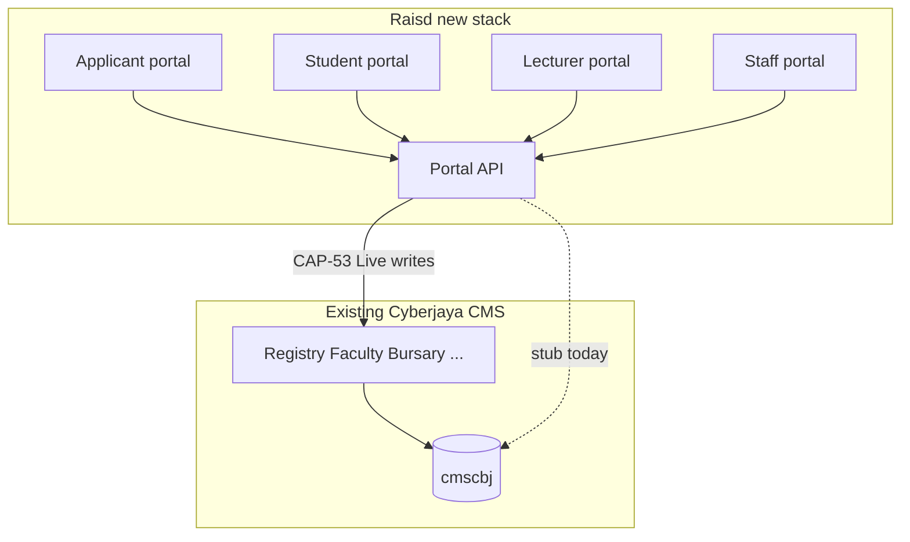

# Old Cyberjaya CMS ↔ Raisd portals — feature comparison

**Date:** 23 September 2026  
**Old CMS source:** `CMS_Cyberjaya_Source_Codes_&_DB_Structure_23_09_2026.zip` (inventory: [old-cms-cyberjaya.md](old-cms-cyberjaya.md))  
**New surface:** Raisd **four portals + Portal API** ([SDD-01](../../sdd/01-system-overview.md), [SDD-11](../../sdd/11-capability-catalog.md)) — **not** a greenfield CMS replacement.  
**GitHub Pages (diagrams + verbose HTML):** [`docs/diagrams/old-cms/`](../../diagrams/old-cms/) — Comparison · FSD · Legacy ERD · Flows · Database (triggers / SPs / batches).

## Published pages (start here for diagrams)

| Page | Contents |
|---|---|
| [Hub](../../diagrams/old-cms/index.html) | Stats, ADR-1 framing, section index |
| [Feature comparison](../../diagrams/old-cms/comparison.html) | Verbose CAP matrices, domain mapping, gaps |
| [FSD](../../diagrams/old-cms/fsd.html) | Functional structure of PHPMaker/Laravel modules |
| [Legacy ERD](../../diagrams/old-cms/erd.html) | Physical `r_*` / `f_*` / `b_*` / `app_*` relationships |
| [Flows](../../diagrams/old-cms/flows.html) | Nightly batch, admissions, registration, LoginActive, write paths |
| [Database](../../diagrams/old-cms/database.html) | ~237 triggers, ~318 SPs, cyberbatch jobs, [CAP-53](../../sdd/11-capability-catalog.md#cap-53) implications |

Machine extracts: [`_trigger-summary.txt`](../../diagrams/old-cms/_trigger-summary.txt), [`_proc-catalog.txt`](../../diagrams/old-cms/_proc-catalog.txt).

## How to read this document

| Term | Meaning |
|---|---|
| **Old CMS** | Existing Cyberjaya campus management system (`cmscbj` + `cyberjaya/campus` modules). Remains system of record (ADR-1). |
| **New stack** | Applicant, Student, Lecturer, Staff portals talking only to the **Portal API**. |
| **Old coverage** | Evidence that the capability already exists in old CMS code/schema/menus. Values: **Present**, **Partial**, **Not found**, **Needs owner confirm**. |
| **New status** | Software status from SDD-11 for the relevant portal surface (Frontend column). Demo ≠ Live. |
| **Launch posture** | What delivery should do: **Reuse old CMS**, **Expose via Portal API**, **Build new UI**, or **Defer / gap only**. |

Status words follow [../process/status-language.md](../process/status-language.md).



## Executive summary

1. The old CMS is a **full campus operations suite** (admissions, registry, faculty, bursary, lecturer, services/visa, accommodation, AQA, library, reporting, LEC, training, payment, PDPA). Raisd’s new stack is a **modern multi-portal UX + API layer** on top of that record.
2. **This phase (confirmed Aslam, 23 Sep 2026):** Cyberjaya CMS remains **system of record**; build portals via the Portal API; **do not duplicate** operational functions the old CMS already runs.
3. **Longer term:** still aim for a **unified one-stop CMS**, delivered **progressively** on verified gaps with an explicit migration strategy ([M5](../../sdd/03-delivery-milestones.md#m5)+ / remaining-CMS — not [M2](../../sdd/03-delivery-milestones.md#m2)–[M4](../../sdd/03-delivery-milestones.md#m4) launch rewrite).
4. Most **Admin / Staff** CAPs already have an old-CMS desk. Default: **do not rebuild**; verify and deep-link or keep staff on old CMS until a gap is proven ([SDD-07](../../sdd/07-admin-staff-cms.md)).
5. The **Student portal** is the deepest new UI (mostly Demo/Partial). Old CMS holds the underlying records; Live needs [CAP-53](../../sdd/11-capability-catalog.md#cap-53) mapping, not a second ledger.
6. **Applicant** and **Lecturer** portals are largely **Not started** as Raisd apps, while old CMS already has Marketing/Registry admissions and a Lecturer Portal 1.0.
7. Old CMS has **heavy Malaysia-specific ops** (EMGS, KDN/MPWA, eIPTS, PTPTN, MQA/KPT) that exceed many CAP wordings — keep them on old CMS unless a portal journey explicitly needs them.
8. Gaps where the **new** product intents go beyond clear old-CMS menus: polished mobile shells, portfolio/resume builders, modern LMS-style quizzes/live class productisation, unified helpdesk UX, and a single Portal API contract. Treat as product decisions, not automatic rebuilds.

### High-level comparison and target delivery

| Horizon | What we deliver | System of record |
|---|---|---|
| **This phase ([M1](../../sdd/03-delivery-milestones.md#m1)–[M4](../../sdd/03-delivery-milestones.md#m4))** | Modern Applicant / Student / Lecturer / Staff experiences via Portal API; staff ops stay on verified old desks unless a gap is proven | Existing Cyberjaya CMS |
| **[M2](../../sdd/03-delivery-milestones.md#m2)** | Admissions launch (apply → offer → enrol) | Existing CMS |
| **[M3](../../sdd/03-delivery-milestones.md#m3)** | Core student portal + paired lecturer/staff paths | Existing CMS |
| **[M4](../../sdd/03-delivery-milestones.md#m4)** | Cyberjaya pilot acceptance | Existing CMS + Portal API |
| **Longer term ([M5](../../sdd/03-delivery-milestones.md#m5)+)** | Campus expansion + progressive consolidation toward one-stop CMS | Migrate domain-by-domain after verified gap + migration strategy |

Published comparison UI: [../../diagrams/old-cms/comparison.html](../../diagrams/old-cms/comparison.html). Milestones: [SDD-03](../../sdd/03-delivery-milestones.md).

## System-level comparison

| Dimension | Old Cyberjaya CMS | Raisd new stack |
|---|---|---|
| Architecture | Many PHPMaker (+ Laravel) apps sharing MySQL `cmscbj` | Four webs + Portal API + campus config in control-plane |
| System of record | Yes (live campus DB) | No at launch — Portal API must acknowledge CMS writes for Live |
| Student UX | Legacy portal login gating + dossier apps; API SPs exist | Modern student-portal Demo UI (deepest Raisd frontend) |
| Staff UX | Complete desk suite | staff-portal **Not started**; build **gaps only** |
| Lecturer UX | Lecturer Portal 1.0 + Faculty desk | lecturer-portal **Not started** |
| Applicant UX | Online application tables + Agent* SPs + Marketing/Registry | applicant-portal **Not started** |
| Auth | Per-module login, user levels, `loginactive` rules | Planned SSO/session via Portal API ([CAP-01](../../sdd/11-capability-catalog.md#cap-01)) — Needs checking |
| Files | Document tables + upload trees in zip | Durable evidence store required for Live ([CAP-03](../../sdd/11-capability-catalog.md#cap-03)/09/20/46) |
| Hosting | Existing UltaHost / batch scripts | k3s plan for portals; CMS stays off Kubernetes ([SDD-12](../../sdd/12-deployment-architecture.md)) |

---

## CAP matrix (canonical IDs)

Legend for **Old coverage:** Present = clear module/table/SP evidence · Partial = related data or partial workflow · Not found = no clear evidence in this dump · Needs owner confirm = evidence exists but production use / exact workflow still TBC.

### Applicant / Online Registration

| CAP | Feature | Old CMS evidence | Old | New FE | Launch posture |
|---|---|---|---|---|---|
| [CAP-01](../../sdd/11-capability-catalog.md#cap-01) | Applicant sign-in / account | Agent/online application SPs; staff logins exist. Dedicated Raisd applicant IdP not verified. | Partial | Not started | Confirm legacy login vs new account; map via Portal API |
| [CAP-02](../../sdd/11-capability-catalog.md#cap-02) | Online application form | `app_applicationformonline`, Marketing/Registry Application menus, `AgentSubmitApplication*` | Present | Not started | **Expose via Portal API**; reuse CMS fields |
| [CAP-03](../../sdd/11-capability-catalog.md#cap-03) | Upload application documents | `app_document`, `app_docfile`, doc review screens | Present | Not started | **Expose** durable upload path + Registry review on old CMS |
| [CAP-07](../../sdd/11-capability-catalog.md#cap-07) | Track application / offer / accept enrolment | `app_zstatus`, pre-offer, offer letters, graduation/enrol handoffs | Present | Not started | Reuse Registry/Marketing workflows; applicant track UI new |
| [CAP-16](../../sdd/11-capability-catalog.md#cap-16) | Applicant announcements | `s_notice` exists campus-wide; applicant-specific feed Needs checking | Partial | Not started | Confirm Marketing ownership |
| [CAP-35](../../sdd/11-capability-catalog.md#cap-35) | Accessible application forms | Not evidenced as a11y programme | Not found | Not started | New UX requirement on applicant portal |
| [CAP-36](../../sdd/11-capability-catalog.md#cap-36) | Mobile online-registration shell | Desktop PHPMaker / agent flows | Not found | Not started | New Raisd shell |
| [CAP-55](../../sdd/11-capability-catalog.md#cap-55) | Applicant policies / declarations | Forms / letters infrastructure (`r_form`, `s_letter`); policy pack Needs checking | Partial | Not started | Confirm content owners |

### Student

| CAP | Feature | Old CMS evidence | Old | New FE | Launch posture |
|---|---|---|---|---|---|
| [CAP-01](../../sdd/11-capability-catalog.md#cap-01) | Student sign-in / logout | `r_student.loginactive`, `portal.sql`, `api_student_login_info`, changepwd | Present | Placeholder | Map to Portal API session; keep balance/VIP rules |
| [CAP-08](../../sdd/11-capability-catalog.md#cap-08) | Personal details / emergency contacts | `r_stdpersonal`, `r_stdrelation*`, SIU update desk | Present | Demo | Student edits via API; staff SIU/Registry remains SoR |
| [CAP-09](../../sdd/11-capability-catalog.md#cap-09) | Student documents library | `r_studentportaldoc`, stdfile/studentfile dossiers | Present | Partial | Authorised file delivery via API + CMS storage |
| [CAP-10](../../sdd/11-capability-catalog.md#cap-10) | Semester subject / class registration | `r_stdsemester`, `r_stdmodule`, `online_enrollment`, `ProgramsAllowedToRegister` | Present | Demo | **Atomic CMS registration** via Portal API |
| [CAP-11](../../sdd/11-capability-catalog.md#cap-11) | Class timetable | `p_timetable*`, class/module structures, timetable reports | Present | Demo | Read from CMS timetable |
| [CAP-12](../../sdd/11-capability-catalog.md#cap-12) | Attendance records | `r_stdattendance*`, `f_attend*`, Adobe Connect attendance | Present | Demo | Read CMS; corrections on Faculty/Lecturer |
| [CAP-13](../../sdd/11-capability-catalog.md#cap-13) | Grades / results / progress | Mark update SPs, gradebook/BOE faculty paths, dean lists | Present | Demo | Publish rules stay on Registry/Faculty |
| [CAP-14](../../sdd/11-capability-catalog.md#cap-14) | Study plan / prerequisites | Programme/module structures, entry requirements (CDU) | Present | Demo | Map programme version rules carefully |
| [CAP-15](../../sdd/11-capability-catalog.md#cap-15) | Graduation / transcripts | `app_graduation*`, PrintTranscript, SIU/Registry | Present | Placeholder | Keep official transcript on old CMS |
| [CAP-16](../../sdd/11-capability-catalog.md#cap-16) | Announcements | `s_notice` | Present | Partial | Feed ownership Needs checking |
| [CAP-17](../../sdd/11-capability-catalog.md#cap-17) | Study guides | Module materials (`f_modulemat`) — guide-specific Needs checking | Partial | Not started | Confirm Faculty publishing |
| [CAP-18](../../sdd/11-capability-catalog.md#cap-18) | Lecture notes / learning media | `f_modulemat`, lecturer notes reports | Present | Placeholder | Authorised download via API |
| [CAP-19](../../sdd/11-capability-catalog.md#cap-19) | Assignment briefs | Forms / module materials; dedicated assignment product Partial | Partial | Partial | Confirm Faculty workflow |
| [CAP-20](../../sdd/11-capability-catalog.md#cap-20) | Submit / replace / withdraw assignments | Limited clear dedicated submission product in menus | Partial | Demo | Needs durable store + staff receipt path |
| [CAP-21](../../sdd/11-capability-catalog.md#cap-21) | Revision / practice | Not clearly found as first-class menu | Not found | Not started | Product decision |
| [CAP-22](../../sdd/11-capability-catalog.md#cap-22) | Past examination papers | Final exam timetable present; past-paper library Needs checking | Partial | Not started | Confirm access rights |
| [CAP-23](../../sdd/11-capability-catalog.md#cap-23) | Course info / learning outcomes | `f_program*`, `f_module*` | Present | Partial | Approve content via Faculty/CDU |
| [CAP-24](../../sdd/11-capability-catalog.md#cap-24) | Online quizzes / examinations | No modern quiz engine found; exam dates / marks exist | Partial | Placeholder | Gap vs LMS intent |
| [CAP-25](../../sdd/11-capability-catalog.md#cap-25) | Student–lecturer communication | Notices; not a full messaging product | Partial | Demo | Product decision |
| [CAP-26](../../sdd/11-capability-catalog.md#cap-26) | Live online classes | Adobe Connect tables + Streaming link | Present | Not started | Integrate approved meeting tool; do not invent |
| [CAP-27](../../sdd/11-capability-catalog.md#cap-27) | Self-paced learning / release schedules | Module materials + release concepts Partial | Partial | Partial | Define journey |
| [CAP-28](../../sdd/11-capability-catalog.md#cap-28) | View marks / lecturer feedback | Marks present; feedback UX Needs checking | Partial | Not started | Pair with lecturer marking |
| [CAP-29](../../sdd/11-capability-catalog.md#cap-29) | Assessment identity / integrity | Not clearly found | Not found | Not started | Policy + product |
| [CAP-30](../../sdd/11-capability-catalog.md#cap-30) | Student feedback / course evaluation | `s_questionnaire`, `r_stdquestionnaire`, `r_stdsurvey` | Present | Placeholder | QA owns reporting |
| [CAP-31](../../sdd/11-capability-catalog.md#cap-31) | Digital library / e-resources | Library `r_elibrary` | Present | Not started | Licence/access integration |
| [CAP-32](../../sdd/11-capability-catalog.md#cap-32) | Orientation / digital-learning skills | Training module is staff-oriented; student induction Needs checking | Partial | Not started | Content owners TBC |
| [CAP-33](../../sdd/11-capability-catalog.md#cap-33) | Learner support / IT helpdesk | `cms_inquiry`, forms; not a unified ticket product | Partial | Partial | Confirm channels |
| [CAP-34](../../sdd/11-capability-catalog.md#cap-34) | Study-centre / regional support | Multi-campus/agent patterns; Cyberjaya-scoped Needs checking | Partial | Not started | Campus expansion |
| [CAP-35](../../sdd/11-capability-catalog.md#cap-35) | Accessibility / special needs | Not found as dedicated product | Not found | Demo | New UX + support process |
| [CAP-36](../../sdd/11-capability-catalog.md#cap-36) | Mobile portal shell | Legacy desktop-oriented | Not found | Partial | Raisd owns shell |
| [CAP-39](../../sdd/11-capability-catalog.md#cap-39) | Privacy / permissions / cybersecurity | ICU PDPA app, user levels, portal blocks | Present | Partial | Server-enforced authz on Portal API |
| [CAP-45](../../sdd/11-capability-catalog.md#cap-45) | Finance balances / invoices / history | `b_statement*`, invoices, receipts, bursary desk | Present | Demo | Read ledger from CMS |
| [CAP-46](../../sdd/11-capability-catalog.md#cap-46) | Bank-transfer proof submission | `b_paymentverification` | Present | Demo | Proof ≠ payment; Bursary verifies |
| [CAP-47](../../sdd/11-capability-catalog.md#cap-47) | Online payment / financial documents | Laravel `payment/`, receipts, banks | Present | Placeholder | Confirm gateway path |
| [CAP-48](../../sdd/11-capability-catalog.md#cap-48) | Scholarships / incentives | Assistance providers, incentive rules, scholarship reports | Present | Demo | Bursary/Marketing ownership |
| [CAP-49](../../sdd/11-capability-catalog.md#cap-49) | Resume / portfolio builders | Not found | Not found | Demo | New product; low priority vs SoR |
| [CAP-50](../../sdd/11-capability-catalog.md#cap-50) | Immigration / visa (student view) | Rich SSD/Services visa + student visa tables | Present | Placeholder | Student view via API; ops stay on Services |
| [CAP-51](../../sdd/11-capability-catalog.md#cap-51) | Requests / complaints / appeals | `r_form`, `f_complaint`, appeals stems in Registry | Present | Placeholder | Online Forms maps here |
| [CAP-52](../../sdd/11-capability-catalog.md#cap-52) | Accommodation (student) | Full Accommodation System | Present | Placeholder | Student request UX new; allocation on old CMS |
| [CAP-54](../../sdd/11-capability-catalog.md#cap-54) | Campus services information | Services desk + forms; published “services info” Partial | Partial | Demo | Content ownership |
| [CAP-55](../../sdd/11-capability-catalog.md#cap-55) | University policies | Letters/forms; approved policy pack Needs checking | Partial | Partial | Registry publish path |

### Lecturer

| CAP | Feature | Old CMS evidence | Old | New FE | Launch posture |
|---|---|---|---|---|---|
| [CAP-11](../../sdd/11-capability-catalog.md#cap-11) | Teaching timetable / allocations | Lecturer modules view, Faculty classes, timetable | Present | Not started | Prefer old Lecturer Portal until gap proven |
| [CAP-12](../../sdd/11-capability-catalog.md#cap-12) | Record / correct attendance | Attendance screens + Adobe Connect attendance | Present | Not started | Reuse Faculty/Lecturer CMS |
| [CAP-17](../../sdd/11-capability-catalog.md#cap-17)–23, 28–29, 43–44 | Publish materials, briefs, marking, workspace | Modules, `f_modulemat`, forms, supervisor students, streaming | Present / Partial | Not started | Verify before new lecturer-portal screens |
| [CAP-24](../../sdd/11-capability-catalog.md#cap-24)–27, 40 | Quizzes, messaging, live class product, analytics | Adobe Connect + engagement report; quizzes Partial | Partial | Not started | Product gaps — Needs checking |
| [CAP-36](../../sdd/11-capability-catalog.md#cap-36) | Mobile lecturer workspace | Not found | Not found | Not started | New if required |

### Admin / Staff (build gaps only)

| CAP | Feature | Old CMS desk | Old | New FE | Launch posture |
|---|---|---|---|---|---|
| [CAP-03](../../sdd/11-capability-catalog.md#cap-03), 05–07 | Application review, quals, offers, first enrolment | Registry, Marketing, CDU (foreign quals / entry req) | Present | Not started | **Reuse old CMS** for [M2](../../sdd/03-delivery-milestones.md#m2) if verified |
| [CAP-08](../../sdd/11-capability-catalog.md#cap-08)–10, 13, 15–16, 55 | Student records, docs, registration config, results, graduation, announcements, policies | Registry, SIU, Faculty | Present | Not started | Reuse; Portal API for student-facing only |
| [CAP-45](../../sdd/11-capability-catalog.md#cap-45)–48 | Invoices, proof verify, scholarships, online reconcile | Bursary + payment app | Present | Not started | Reuse Bursary/Finance |
| [CAP-04](../../sdd/11-capability-catalog.md#cap-04), 30, 40, 42–43 | Approvals, evaluations, analytics, copyright, LMS readiness | CDU / AQA, questionnaires, ICU PDPA | Present / Partial | Not started | Reuse; evidence collection for [CAP-04](../../sdd/11-capability-catalog.md#cap-04) |
| [CAP-11](../../sdd/11-capability-catalog.md#cap-11), 14, 22–24 | Schedule, study plans, past papers, exams admin | Faculty | Present | Not started | Reuse Faculty |
| [CAP-16](../../sdd/11-capability-catalog.md#cap-16) (Marketing) | Recruitment communications | Marketing | Present | Not started | Reuse Marketing |
| [CAP-31](../../sdd/11-capability-catalog.md#cap-31)–36, 44, 49–54 | Library admin, orientation publish, helpdesk, centres, a11y, mobile staff, workspace, career, visa ops, requests, housing, services publish | Library, Training, Services, Accommodation, Inquiry, ICU | Present / Partial | Not started | Default **reuse**; UI only for verified gaps |
| [CAP-44](../../sdd/11-capability-catalog.md#cap-44) | Staff workspace / role access | User levels across all desks | Present | Not started | Confirm admissions staff can already work in old CMS |

### Shared system

| CAP | Feature | Old CMS evidence | Old | New | Launch posture |
|---|---|---|---|---|---|
| [CAP-37](../../sdd/11-capability-catalog.md#cap-37) | Connectivity / monitoring | Ops scripts exist; monitoring product Needs checking | Partial | Needs checking | Ops owner |
| [CAP-38](../../sdd/11-capability-catalog.md#cap-38) | Backups / continuity | `CYBERJAYA-SCRIPT` daily/weekly/monthly + S3 sync scripts | Present | Needs checking | Verify restore tests |
| [CAP-39](../../sdd/11-capability-catalog.md#cap-39) | Privacy / cybersecurity | ICU PDPA + user permissions | Present | Needs checking | Extend to Portal API |
| [CAP-41](../../sdd/11-capability-catalog.md#cap-41) | Staff training / readiness | `training/` module | Present | N/A software | Operating evidence TBC |
| [CAP-42](../../sdd/11-capability-catalog.md#cap-42) | Copyright / provider controls | Partial / policy | Partial | N/A software | Non-software checks |
| [CAP-53](../../sdd/11-capability-catalog.md#cap-53) | Existing CMS integration / campus config | API SPs + portal tables + rich schema | Present (legacy) | Partial FE / Needs checking BE | **Critical path** — map admissions then registration |

---

## Old CMS modules with weak or no Raisd CAP coverage

These are real Cyberjaya operations. They are **not** missing CAP IDs by accident; most stay on old CMS unless product expands scope.

| Old CMS area | Examples | Raisd note |
|---|---|---|
| Agent management | `m_agent`, Agent* SPs, claim checks | Agent portal is separate from Applicant portal; out of CAP set unless added |
| LEC / English Centre | `lec/` summer camp, LEC marks | Campus-specific; not in SDD-11 |
| Friends Get Friends / internal promo | bursary FGF, reporting promo lists | Marketing/Bursary ops |
| Inventory | Faculty `inv_item` | Facilities ops |
| Smart card / parking payment | reporting SmartCard; payment vehicle/parking | Campus services ops |
| Heavy regulatory reporting | MPWA, KDN, eIPTS, EMGS STAR, SETARA dossiers | Malaysia SSD — keep on Services/Registry/CDU |
| Board / Senate / Faculty reports | PrintLetter, transcripts, senate reports | Academic governance reporting |
| Projected / intake population analytics | Many projected-student SPs | Planning reports |
| Staff PDPA compliance | ICU Laravel | Shared [CAP-39](../../sdd/11-capability-catalog.md#cap-39) adjacent |

---

## New stack capabilities weakly evidenced in old CMS

| Raisd intent | Gap in old dump | Implication |
|---|---|---|
| Modern mobile-first shells ([CAP-36](../../sdd/11-capability-catalog.md#cap-36)) | Desktop PHPMaker | Raisd owns UX |
| Resume / portfolio builders ([CAP-49](../../sdd/11-capability-catalog.md#cap-49)) | Not found | Optional new product |
| Unified messaging / LMS quizzes ([CAP-24](../../sdd/11-capability-catalog.md#cap-24)/25) | Notices + Adobe; no quiz engine found | Do not claim Live from notices alone |
| Accessibility programme ([CAP-35](../../sdd/11-capability-catalog.md#cap-35)) | Not found | New requirement |
| Single OpenAPI Portal API ([CAP-53](../../sdd/11-capability-catalog.md#cap-53)) | Legacy `api_student_*` SPs only | New integration layer |
| Design-system consistent four portals | Separate PHP apps per desk | Intentional product change |

---

## Recommended delivery implications

1. **Admissions launch ([M2](../../sdd/03-delivery-milestones.md#m2)):** Treat Registry + Marketing + online application tables/SPs as the SoR. Build applicant-portal UX + Portal API adapters; keep offer/enrol decisions on old CMS until verified otherwise.
2. **Core student portal:** Map Demo screens to `r_*` / `b_*` / timetable / attendance / documents. Do not invent a second finance or registration engine.
3. **Lecturer / staff Raisd apps:** Inventory verification first. New screens only for **verified gaps**.
4. **Immigration / accommodation / library:** Prefer student **read/request** surfaces in Raisd; keep operational desks on Services / Accommodation / Library.
5. **[CAP-53](../../sdd/11-capability-catalog.md#cap-53) first slice:** Start with auth + applicant create/read + document metadata, using existing `app_*` and `api_student_*` as discovery aids — then semester registration.

## Open confirmation list (owners TBC)

Carry into [SDD-10](../../sdd/10-open-questions.md):

1. Which legacy student-facing URL is still Live for Cyberjaya (vs staff-only stdfile)?
2. Exact mapping of `api_student_*` and portal sync tables to Raisd Portal API methods.
3. Whether Agent online application remains in parallel with Raisd applicant-portal.
4. Production use of Adobe Connect vs replacement meeting tool ([CAP-26](../../sdd/11-capability-catalog.md#cap-26)).
5. Whether assignment submission is file-drop on module materials, forms, or another path ([CAP-20](../../sdd/11-capability-catalog.md#cap-20)).
6. Backup restore test evidence for [CAP-38](../../sdd/11-capability-catalog.md#cap-38) (scripts exist; tests unverified from dump alone).

## Technical deep dive — database, triggers, procedures, batches

Authoritative interactive diagrams: [database.html](../../diagrams/old-cms/database.html), [flows.html](../../diagrams/old-cms/flows.html), [erd.html](../../diagrams/old-cms/erd.html).

### Databases seen in dumps / scripts

| Name | Role |
|---|---|
| `cmscbj` | Structure dump host DB (23 Sep 2026) |
| `campus2_cyberjaya` | Live batch target in 2019 night script |
| `portalcyberjaya` | Portal-facing sync DB (receives `r_student` dump) |

### Core physical chain (legacy ERD)

```text
app_applicationform (ApplicationID)
        │
        ▼
r_student (StudentID) ── r_stdpersonal
        │
        ├── r_stdprogram (StdProgramID) → f_program (ProgramID)
        │         │
        │         └── r_stdsemester (StdSemesterID) → f_term (TermID)
        │                   │
        │                   └── r_stdmodule (StdModuleID) → f_module (ModuleID)
        │                             │
        │                             └── r_stdattendance / marks fields
        ├── b_statement / b_invoicedetail / b_payment / b_receipt
        ├── w_visa / r_stdimmigration
        └── LoginActive + portal_* snapshot tables
```

`r_student` alone is **100+ columns**, including denormalised finance (`AccOutstanding`, `AccBalance`) and portal gating (`LoginActive`). Raisd canonical ERD must **not** mirror this width — translate via [CAP-53](../../sdd/11-capability-catalog.md#cap-53).

### Triggers (~237 on ~107 tables)

| Timing | Count (approx.) |
|---|---:|
| BEFORE INSERT | 68 |
| AFTER UPDATE | 61 |
| AFTER INSERT | 56 |
| BEFORE UPDATE | 52 |

**Hot tables (4 triggers each):** `r_student`, `r_stdprogram`, `r_stdsemester`, `r_stdpersonal`, `app_applicationform`, `w_visa`, `r_stdofferletter`, `f_lecturer`, `r_form`, `r_stdagent`, `std_agentchange`, …

**Example behaviour:** `r_student` AFTER INSERT seeds related rows (e.g. `r_starter`, contact stubs) and historically autocharge paths. [CAP-53](../../sdd/11-capability-catalog.md#cap-53) inserts must expect side effects.

Domain prefixes among trigger names: `f_*` ~58, `r_*` ~57, `app_*` ~23, `b_*` ~22, `acc_*` ~14, `w_*` ~11.

### Stored procedures (~318)

| Category | Count (approx.) | Examples |
|---|---:|---|
| Generic `sp_*` | ~118 | `sp_application_fetch`, `sp_all_timetable`, `sp_enrollment_minimum_amount` |
| Agent / online application | ~56 | `AgentSubmitApplication`, `AgentInsertUpdateDocuments`, `AgentUpdateApplicationStatus` |
| Intake / population reports | ~50 | `freshnewstudent*`, `returningstudent*`, `projected*` |
| Bursary refresh `b_Update_*` | ~29 | `b_Update_Student`, `b_Update_Student_Mark`, `b_Update_billing` |
| Visa / immigration | ~12 | KDN/visa helpers |
| API helpers | 6 | `api_student_login_info`, `api_student_module_info`, `api_student_program_info`, `api_student_semester_info`, `api_faculty_list`, `api_faculty_program_list` |

Many dated `_copy` / `_backup` procedure variants exist — production must identify the Live name with the CMS owner (Q2 / Q26).

### Nightly batch (`cyberjayabatchnight*.sh`)

Observed sequence (full 2019 variant):

1. Optional `httpd` stop (older script)  
2. `registry.sql` → `attendance.sql` → `examination.sql` → `accomodation.sql` → `Bursary.sql` → `SSD.sql` → `VisaReport.sql` → `portal.sql` → `portalcontact.sql` → `report.sql` → `cleanup.sql`  
3. Optional `httpd` start  
4. **Portal sync exports** via `mysqldump` into `cyber.sql`, `transcript.sql`, `upload.sql`, report dumps → gzip + size gate (>100KB) before promoting backup  

`portal.sql` sets `r_student.LoginActive` from outstanding balance, VIP, PTPTN windows, `StdPortalActive` / term dates, scholarship exceptions. Raisd auth Live must either honour these rules or explicitly replace them with an agreed policy.

Email/SMS side jobs (examples): `VisaNotificationEmail.sh`, `ProgramApprovalEmail.sh`, `accommodationrentalduemail.sh`, `summarystudentreportmail.sh`.

### [CAP-53](../../sdd/11-capability-catalog.md#cap-53) engineering implications

1. **Writes must survive triggers** — do not assume a single-row insert is isolated.  
2. **Balances / CGPA** often depend on `b_Update_Student*` and examination/registry batch — API acknowledgements should follow the same invariants.  
3. **LoginActive** is a batch-owned gate; Portal API session Live ≠ “always allow if password ok”.  
4. **Agent\* / api_student_\*** are discovery aids, not the Raisd OpenAPI contract.  
5. **Portal dump table list** in the 2019 script is a practical minimum sync set for read adapters (timetable, modulemat, visa, finance items, …).

## Related documents

- Inventory detail: [old-cms-cyberjaya.md](old-cms-cyberjaya.md)
- GitHub Pages section: [../../diagrams/old-cms/](../../diagrams/old-cms/)
- Human SDD twin: [../../sdd/14-cms-feature-comparison.md](../../sdd/14-cms-feature-comparison.md)
- Capability statuses: [../../sdd/11-capability-catalog.md](../../sdd/11-capability-catalog.md)
- Staff build rule: [../../sdd/07-admin-staff-cms.md](../../sdd/07-admin-staff-cms.md)
- Raisd canonical ERD (do not mirror legacy): [../../diagrams/erd.html](../../diagrams/erd.html)
