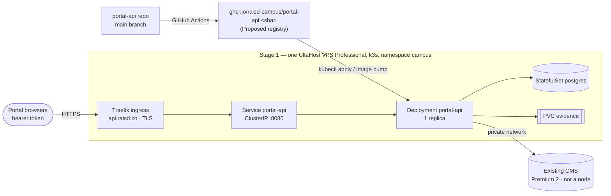

# Portal API — target deployment

**Status:** Target design (27 September 2026). Nothing below is deployed yet; the only running form is local Demo.\
**Canonical hosting decision:** [SDD-12](../../sdd/12-deployment-architecture.md) (ADR-2 UltaHost Singapore, ADR-3 k3s). Agent summary: [architecture/deployment.md](../architecture/deployment.md).\
**Code:** [`raisd-campus/portal-api`](https://github.com/raisd-campus/portal-api). **Plan:** [portal-api-development-plan.md](portal-api-development-plan.md). **PoC path:** [portal-api-poc-requirements.md](portal-api-poc-requirements.md).

This file turns SDD-12 into the concrete build, runtime and release shape for the `portal-api` Deployment. It adds no new provider, node, or hostname. Where it proposes something SDD-12 does not state (image registry, manifest layout, resource sizes), it is marked **Proposed**.

## 1. Target at a glance

## 2. Environments

SDD-08 §4 names the environments (proposed, not yet agreed). The Portal API maps onto them like this:

| Environment | Where | CMS mode | Data | Hostname | Status |
|---|---|---|---|---|---|
| Local | Developer machine, sibling checkouts | `stub` | In-memory / local Postgres | `http://127.0.0.1:8080` | Running (Demo) |
| PoC | Vercel project + Neon free tier | `stub` | Neon (sessions, Demo tables) | `*.vercel.app` | Not started — [requirements](portal-api-poc-requirements.md) |
| Integration | k3s stage 1 node, separate namespace or a second Deployment | `live` against a **non-production** CMS | Postgres (integration DB) | Internal / not public | Not started |
| Staging | k3s, Cyberjaya-like config | `live` against staging CMS | Postgres (staging DB) | TBC with backend owner | Not started |
| Production | k3s, namespace `campus` | `live` against Cyberjaya CMS | Postgres + evidence PVC | `api.raisd.co` | Not started; Live only after M4 |

Do not publish `api.raisd.co` before the production Deployment exists (SDD-12 §5).

## 3. Stage progression for this service

| SDD-12 stage | Node | Portal API change |
|---|---|---|
| 1. Minimum | One VPS Professional (3 vCPU / 4 GB / 75 GB) | First Deployment, 1 replica, `CMS_MODE=stub` until the CMS adapter passes integration. Postgres + evidence PVC beside it |
| 2. Admissions launch | Same node resized to 4 vCPU / 6 GB | `CMS_MODE=live` for Cyberjaya admissions. Backup CronJob for Postgres + evidence. Readiness gate on DB |
| 3. Core student | Edge node added; data node → POWER Plus | Stays on the **data node** by node selector; ingress moves to the edge node. No API change |
| 4. Pilot acceptance | No change | Restore drill from backup; load test |
| 5. Campus expansion | Data node grows only when full | Additional campus adapters via config. Replicas > 1 only when SDD-12 says the node is full |

## 4. Build and image

| Item | Target |
|---|---|
| Base image | `node:22-bookworm-slim` (matches `.nvmrc`) |
| Build | Multi-stage: `npm ci` → `npm run build` → copy `dist/` + production `node_modules` only (after [phase 1](portal-api-development-plan.md#phase-1)) |
| Runtime command | `node dist/server.js` as non-root user `node` |
| Bundled assets | `openapi.yaml` + `docs/openapi.html` copied from control-plane at build time so `/openapi.yaml` and `/docs` work |
| Tags | `:<git sha>` immutable; `:main` moving; release tags `:vX.Y.Z` for production promotions |
| Registry | **Proposed:** GitHub Container Registry `ghcr.io/raisd-campus/portal-api` (private). k3s pulls with an `imagePullSecret` |
| Until phase 1 | Current `Dockerfile` builds from `~/src/raisd` with `portal-api/`, `student-portal/` and `control-plane/` in context. Demo only; not for Live |

## 5. Kubernetes objects (Proposed layout)

Manifests live in the portal-api repo under `deploy/k3s/` for objects this service owns. Platform objects shared by the data node stay with control-plane (decision D6 in the plan).

| Object | Owner repo | Notes |
|---|---|---|
| `Deployment portal-api` | portal-api | 1 replica, `nodeSelector` data node from stage 3 |
| `Service portal-api` | portal-api | ClusterIP, port 8080 |
| `Ingress portal-api` | portal-api | Traefik (k3s built-in), host `api.raisd.co`, TLS by Traefik; no cert-manager until needed (SDD-12 §7) |
| `Secret portal-api-env` | created by operator, **never in git** | `DATABASE_URL`, CMS credentials, session secret |
| `ConfigMap portal-api-config` | portal-api | Non-secret env (`CORS_ORIGIN`, `CMS_MODE`, `LOG_LEVEL`) |
| `Job portal-api-migrate` | portal-api | Runs DB migrations before rollout (phase 3) |
| `StatefulSet postgres` + `PVC postgres-data` | control-plane `deploy/` | SDD-12 stage 1 object |
| `PVC evidence` | control-plane `deploy/` | Mounted read-write by portal-api only |
| `CronJob backup` | control-plane `deploy/` | Stage 2 |

No Helm chart beyond what k3s ships (SDD-12 §7). Plain YAML plus `kubectl apply -k` (kustomize is built into kubectl) per environment overlay.

### Pod spec targets

| Setting | Value | Why |
|---|---|---|
| Requests | `cpu: 100m`, `memory: 192Mi` | Fits the 4 GB stage 1 node beside Postgres (~1 GB) and k3s/Traefik (~1 GB) |
| Limits | `memory: 512Mi` (no CPU limit) | Prevent OOM of Postgres on the shared node |
| Liveness | `GET /health`, period 20 s | Process alive |
| Readiness | `GET /ready` (phase 2.8), period 10 s | DB reachable; CMS adapter initialised |
| Startup | `GET /health`, failureThreshold 30 × 2 s | Cold start with migrations |
| Security | `runAsNonRoot`, `readOnlyRootFilesystem` (tmp as emptyDir), drop all capabilities | SDD-08 §5 |
| Termination | `terminationGracePeriodSeconds: 30`; app drains on `SIGTERM` | No half-written CMS calls |
| Strategy | `RollingUpdate`, `maxUnavailable: 0`, `maxSurge: 1` | Zero-downtime on a single replica |

## 6. Configuration

| Variable | Secret? | Local | Production | Notes |
|---|---|---|---|---|
| `PORT` / `HOST` | No | `8080` / `0.0.0.0` | same | |
| `CORS_ORIGIN` | No | `*` (dev) | `https://apply.raisd.co` (+ `student`, `teach`, `staff` as each stage adds them) | Comma list; exact origins |
| `CMS_MODE` | No | `stub` | `live` | `live` refuses to boot if the mock engine is loaded |
| `CAMPUS_DEFAULT` | No | `cyberjaya` | `cyberjaya` | Campus config key |
| `DATABASE_URL` | **Yes** | local Postgres | in-cluster `postgres` Service | Never exposed to portals |
| `CMS_*` (connection) | **Yes** | unset | Premium 2 private address + credentials | Shape follows D5 |
| `SESSION_SECRET` | **Yes** | dev value | generated, rotated per release train | Token hashing / signing |
| `EVIDENCE_DIR` | No | `./.evidence` | `/data/evidence` (PVC mount) | |
| `OPENAPI_ROOT` | No | `../control-plane` | `/app` | Assets baked into image |
| `LOG_LEVEL` | No | `info` | `info` | |
| `STUDENT_PORTAL_ROOT` | No | `../student-portal` | **unset** after phase 1 | Mock bridge only |

## 7. CI/CD

| Workflow | Trigger | Does |
|---|---|---|
| `ci.yml` (in repo now) | PR + push to `main` | Install, boot the API against a checkout of student-portal and control-plane, run `scripts/smoke.sh`. Typecheck and tests join in phase 2 |
| `image.yml` (Proposed, phase 1) | Push to `main`, tags `v*` | Build and push `ghcr.io/raisd-campus/portal-api:<sha>` (+ `:vX.Y.Z` on tags) |
| `deploy.yml` (Proposed, stage 1) | Manual `workflow_dispatch` with environment + tag | `kubectl set image` / `kubectl apply -k deploy/k3s/overlays/<env>` using a kubeconfig stored as an **environment secret** with required reviewers for production |

Secrets are set **per repository**, only on repos whose workflows use them:

| Secret | Repo | Scope | Used by |
|---|---|---|---|
| `RAISD_READ_TOKEN` | `portal-api` (set 27 Sep 2026) | Fine-grained PAT "portal-api CI read-only": resource owner `raisd-campus`, repositories `student-portal` + `control-plane` only, Contents + Metadata read-only. Expires **27 Oct 2026** — regenerate and re-set before then | `ci.yml` checkout of private siblings |
| `GITHUB_TOKEN` (built in) | `portal-api` | Workflow `permissions: packages: read`. The `@raisd-campus/design-system` package grants `portal-api` **Read** under Package settings → Manage Actions access (fine-grained PATs cannot read GitHub Packages) | `ci.yml` `npm ci` of `@raisd-campus/*` packages |
| `KUBECONFIG_STAGING`, `KUBECONFIG_PRODUCTION` | Environment secrets | Kubeconfig per environment | `deploy.yml` |

Never commit kubeconfigs, server passwords, or connection strings (see [architecture/deployment.md](../architecture/deployment.md)).

## 8. Network and security

1. Only Traefik is reachable from the internet; `portal-api` Service is ClusterIP.
2. Postgres and the evidence PVC have no Ingress and no host port.
3. Egress from the API to the CMS host on its private address only; CMS host firewall accepts the data node only (SDD-12 §5 firewall table).
4. TLS terminates at Traefik; HTTP 80 redirects to 443.
5. Bearer tokens only; no cookie on `Domain=.raisd.co` (SDD-12 §5).
6. Logs exclude tokens, file bytes, and personal fields.

## 9. Release, rollback, and recovery

| Action | How |
|---|---|
| Release | Merge to `main` → image `:<sha>` → deploy to staging → UAT → tag `vX.Y.Z` → deploy production with reviewer approval |
| Migrations | Forward-only; `Job portal-api-migrate` runs before the new ReplicaSet; each migration backward-compatible with the previous release |
| Rollback | `kubectl rollout undo deployment/portal-api -n campus` (image only; migrations are not reversed) |
| Backup | Stage 2 CronJob: `pg_dump` + evidence tarball to off-node storage; retention TBC with Aslam |
| Restore drill | Stage 4 acceptance item (SDD-12) |

## 10. First production-shaped deploy checklist

- [ ] Stage 1 node provisioned per SDD-12 §7 (Ubuntu 24.04, k3s single server, namespace `campus`).
- [ ] Phase 1 image builds without `student-portal/`.
- [ ] `GET /ready` and graceful shutdown implemented (phase 2.8).
- [ ] Postgres StatefulSet + evidence PVC applied (control-plane `deploy/`).
- [ ] `portal-api-env` Secret created on the node by an operator.
- [ ] DNS `api.raisd.co` → stage 1 node public IP, only after the Deployment is healthy.
- [ ] CORS limited to the portals deployed at that stage.
- [ ] Smoke script green against the public hostname.
- [ ] Status stays **Demo** until the CMS adapter meets SDD-03 §4.
