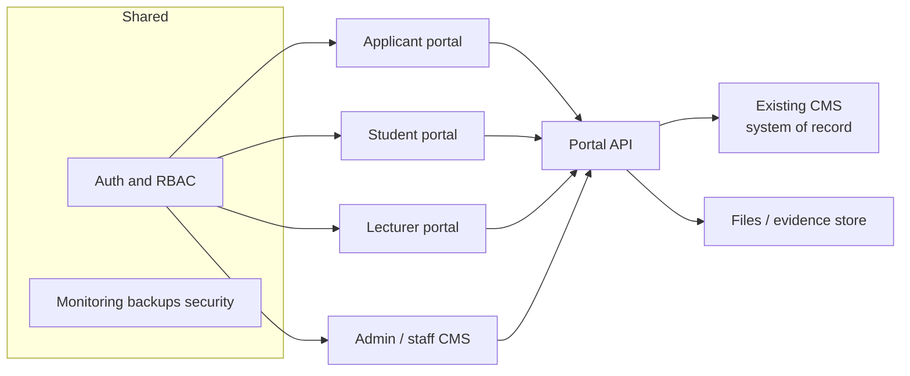

# System overview

**Document:** SDD-01  
**Status:** Working draft  
**Date:** 18 September 2026 (updated 23 September 2026)

## 1. Problem

Campuses need one digital operating surface for applicants, students, lecturers, and staff, while remaining inside existing CMS records, country ODL/QA evidence, and a tight delivery sequence. A student-facing frontend already exists as a demo. Applicant, lecturer, and staff surfaces, plus a live backend, do not.

## 2. System intent

Build **role portals on top of the existing CMS**, not a greenfield replacement of every legacy function.

**This phase (confirmed 23 September 2026 — Aslam):** Cyberjaya CMS remains the **system of record**. Modern applicant / student / lecturer / staff experiences are delivered through the **Portal API**. Do not duplicate operational desks the old CMS already runs.

**Longer term:** aim for a **unified, one-stop CMS**, delivered **progressively** — only when a gap is verified and a migration strategy (ownership, cutover, rollback, training) is agreed. That consolidation is backlog relative to Admissions launch and Cyberjaya pilot; see [SDD-03](03-delivery-milestones.md) [M5](03-delivery-milestones.md#m5)+ and [SDD-14](14-cms-feature-comparison.md).

Four doors, one campus:

| Portal | Job |
|---|---|
| Applicant / online registration | Apply, upload evidence, track, accept enrolment |
| Student | Study, register, pay, receive results, get support |
| Lecturer | Publish materials, take attendance, mark, communicate |
| Admin / staff | Registry, Faculty, Bursary/Finance, QA, Marketing, remaining desks |
| Shared system | Integration, security, availability, training — mostly not screens |

## 3. Scope

### In scope for this SDD set

- [CAP-01](11-capability-catalog.md#cap-01) through [CAP-55](11-capability-catalog.md#cap-55) as listed in [SDD-11](11-capability-catalog.md).
- Cyberjaya as first acceptance campus.
- Phone-friendly core admissions and student journeys.
- Using the existing CMS as the initial system of record.

### Out of scope unless a later decision says otherwise

- Replacing working legacy staff functions that already satisfy a capability.
- Native mobile apps.
- Treating eight-country research domains as universal screen mandates.
- Inferring legal compliance from a frontend percentage.

## 4. Users and departments

| Actor | Typical department | Needs |
|---|---|---|
| Applicant | Registry / Marketing | Account, application, evidence, offer |
| Student | Registry, Faculty, Bursary, support desks | Records, learning, fees, services |
| Lecturer | Faculty | Class list, content, marking |
| Registry officer | Registry | Applications, student master, enrolment, results release |
| Faculty scheduler | Faculty | Classes, rooms, programme rules |
| Bursary / Finance | Bursary, Finance | Invoices, proof verification, reconciliation |
| QA | Quality Assurance | Approvals, materials readiness, evaluations |
| Marketing | Marketing | Applicant communications only; Registry owns formal decisions |
| IT / backend | TBC | Old CMS, Portal API, auth, ops |

Named next-action owners are TBC on every checklist row.

## 5. Current vs target

| Layer | Current (baseline `6811e88`) | This-phase Live target | Longer-term direction |
|---|---|---|---|
| Student UI | Demo / Partial / Placeholder on mock data | Role journeys on real CMS records via Portal API | Same journeys; SoR may migrate per verified gap |
| Applicant UI | No routes | Application-to-enrolment on CMS via Portal API | Unified admissions surface |
| Lecturer UI | No routes | Publish / attendance / marking — prefer verified old Lecturer Portal | Progressive lecturer workspace consolidation |
| Staff UI | No routes; do not rebuild what old CMS already does | Screens only for verified gaps; else old CMS desk | Progressive one-stop staff CMS |
| Backend | Replaceable contracts, mock runtime, CMS writes stubbed | Portal API ↔ existing Cyberjaya CMS ([CAP-53](11-capability-catalog.md#cap-53)) | Migration strategy per domain when retiring legacy |
| Mobile | Isolated Services tests only | Core journeys on phone widths | Unchanged principle |
| Auth | Fixed mock student session; logout no-op | Real login / SSO / provisioning honouring CMS rules where required | Campus-wide identity |

## 6. Design principles

1. **Existing CMS is source of truth for this phase** until a later milestone proves a function should move — with an agreed migration strategy.
2. **Admissions before semester registration.** Student v1 UI depth does not change that order.
3. **Demo is not done.** A screen without durable save and server-enforced permission is not Live.
4. **Proof is not payment.** Bank-transfer evidence stays unverified until Bursary allocates it.
5. **One CAP, many surfaces.** Student “view timetable” and lecturer “record attendance” share [CAP-11](11-capability-catalog.md#cap-11)/12.
6. **Country evidence is confirmation work**, not an automatic feature list.
7. **Build staff screens only for verified gaps** in the old CMS; do not duplicate operational functions.
8. **Unified one-stop CMS is progressive backlog**, not a mandate to rewrite working desks for [M2](03-delivery-milestones.md#m2)–[M4](03-delivery-milestones.md#m4).

## 7. Campus footprint

First gate: **Cyberjaya pilot acceptance**.

Evidence tab also covers Botswana, Cambodia, Eswatini, Lesotho, Malaysia, Namibia, Sierra Leone, and Uganda. Campus expansion never defers an applicable operating requirement if software is delayed — the campus must still run the process, on old CMS or manually, until the new surface is Live.

## 8. Related documents

- Architecture: [SDD-02](02-architecture-and-integration.md)
- Sequence of releases: [SDD-03](03-delivery-milestones.md)
- Traceability: [SDD-09](09-requirements-traceability.md)
