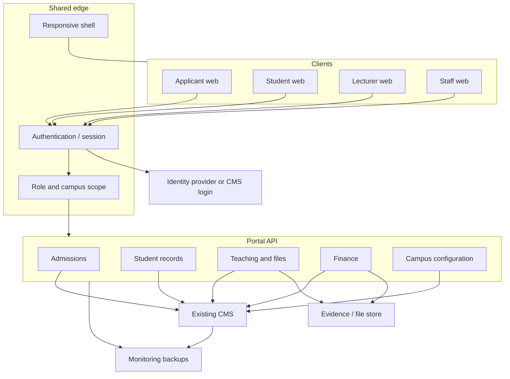

# Architecture and integration

**Document:** SDD-02  
**Status:** Working draft  
**Date:** 18 September 2026 (updated 23 September 2026)

## 1. Architectural decision

**ADR-1 — Existing CMS as initial backend (this phase)**

Keep the current campus CMS as system of record. New portals talk to it through a Portal API. Do not require a full CMS rewrite to launch Cyberjaya.

**Working Group confirmation (23 September 2026 — Aslam):** agreed for this phase — use existing Cyberjaya CMS as SoR; build modern portal experiences via the Portal API; do not duplicate operational functions the old CMS already runs.

Consequences:

- [CAP-53](11-capability-catalog.md#cap-53) (existing CMS integration and campus configuration) is on the critical path for Admissions launch.
- Frontend “ready” screens cannot go Live until the matching old-CMS capability is verified or replaced.
- New staff screens are built only where the old CMS does not already support the workflow.

**Longer-term target:** a unified, one-stop CMS, delivered progressively on **verified gaps** with an explicit **migration strategy**. That is post-pilot / remaining-CMS work ([SDD-03](03-delivery-milestones.md) [M5](03-delivery-milestones.md#m5)+), not a mandate to replace working desks for Admissions launch.

Hosting placement is in [SDD-12](12-deployment-architecture.md): the existing UltaHost VDS estate in Singapore, not a new VPS. The concrete old-CMS product name is still TBC. The student frontend baseline implies a TypeScript web app with replaceable API contracts (`src/services/portal-runtime.tsx`, `src/services/portal-api.ts`).

**Agent operating knowledge** for this architecture lives in [`docs/ai/architecture/`](../ai/architecture/) and [`docs/ai/backend/portal-api.md`](../ai/backend/portal-api.md). Agents must not invent a second integration model. Cyberjaya inventory and CAP comparison: [SDD-14](14-cms-feature-comparison.md).

## 2. Logical architecture

## 3. Integration contract ([CAP-53](11-capability-catalog.md#cap-53))

Current baseline: replaceable API contracts and mock campus ownership exist; **no authenticated HTTP adapter and no live CMS connection**.

Target for Admissions launch:

| Concern | Design rule |
|---|---|
| Access | Named backend owner; credentials for a non-production CMS; campus configuration for Cyberjaya |
| Mapping | Applicant, offer, first enrolment, and student account fields mapped to old-CMS records |
| Auth | Login/SSO path that provisions Applicant and Student roles from CMS identity |
| Files | Evidence uploads land in a durable store the staff workflow can open |
| Failure | Portal never reports a CMS write as complete unless the CMS acknowledges it |
| Scope | Student-scoped tokens; staff tokens cannot be reused in the student shell |

First working integration is admissions + authentication, not the entire student catalogue.

## 4. Identity and access

| Capability | Design |
|---|---|
| [CAP-01](11-capability-catalog.md#cap-01) Applicant / Student sign-in | Real session. Logout ends the session. Password recovery or SSO as the old CMS already provides. Mock “always logged in as one student” is not acceptable for Live. |
| [CAP-44](11-capability-catalog.md#cap-44) Staff workspace | Confirm existing-CMS staff access for admissions first. New staff chrome only for verified gaps. |
| [CAP-39](11-capability-catalog.md#cap-39) Privacy / permissions | Authorisation is server-enforced. Client-side student scoping is not security. |
| [CAP-35](11-capability-catalog.md#cap-35) Accessibility | Core forms and shells work with keyboard and assistive technology. |

Roles at minimum: Applicant, Student, Lecturer, Registry, Faculty, Bursary, Finance, QA, Marketing, Admin. Campus and programme scope ride on the token, not on the UI hiding a menu.

## 5. Files and evidence

Several student demos store metadata only (assignments, payment proof, documents). Live requires:

- Bytes uploaded to a durable store.
- Virus/type checks on the server.
- Permissioned download URLs.
- Staff receipt of the same object the student submitted.
- No treating [CAP-46](11-capability-catalog.md#cap-46) payment proof as a completed payment.

## 6. Mobile (PRODUCT-MOBILE)

Not a native app. Core journeys must work on agreed phone and tablet widths:

[CAP-01](11-capability-catalog.md#cap-01), 02, 03, 07, 11, 16, 17, 18, 19, 20, 21, 22, 35, 36, 55.

Current baseline: whole-portal mobile is not accepted; only isolated Services content has responsive tests.

[CAP-36](11-capability-catalog.md#cap-36) (shell) is a launch dependency for Admissions. Lecturer/staff mobile ([CAP-36](11-capability-catalog.md#cap-36) on those portals) is Campus expansion unless the group promotes it.

## 7. Data ownership

| Domain | System of record (initial) | Portal responsibility |
|---|---|---|
| Applications, offers, enrolment | Existing CMS | Capture, display, handoff |
| Student master, documents | Existing CMS | Constrained edits; approval where required |
| Timetable, attendance, curriculum | Existing CMS | Student view; lecturer/staff write if CMS supports it |
| Learning files | CMS or designated file store | Authorised publish/download |
| Marks | Existing CMS | Display published results only until staff workflow is Live |
| Fees, invoices, allocations | Existing CMS / finance ledger | Display; proof intake; never self-allocate |
| Announcements, policies | Owning department in CMS | Display; acknowledgement if campus requires it |

## 8. Cross-cutting quality

| ID | Requirement | Live evidence |
|---|---|---|
| [CAP-37](11-capability-catalog.md#cap-37) | Connectivity, capacity, monitoring | Uptime target, expected users, dashboards |
| [CAP-38](11-capability-catalog.md#cap-38) | Backups and continuity | Restore test, named owner |
| [CAP-39](11-capability-catalog.md#cap-39) | Privacy and cybersecurity | Policy + server controls |
| [CAP-41](11-capability-catalog.md#cap-41) | Staff training | Training record before Cyberjaya acceptance |
| [CAP-42](11-capability-catalog.md#cap-42) | Copyright / providers | Operating approval, not a screen |

Frontend screens do not establish operational readiness.

## 9. Non-goals for architecture v0.1

- Event-sourcing or a new canonical data warehouse.
- Replacing the old CMS finance engine.
- Building a second identity system if CMS login already works.
- Assuming Supabase or any other store from the earlier commercial proposal until the group names the stack.

## 10. Open architecture questions

See [SDD-10](10-open-questions.md). Blocking items: repo access, old-CMS owner, API surface already callable, SSO vs CMS password, file-store product, environments.
