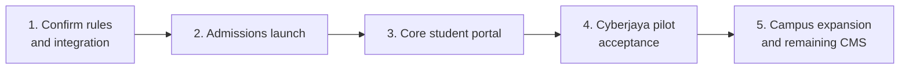
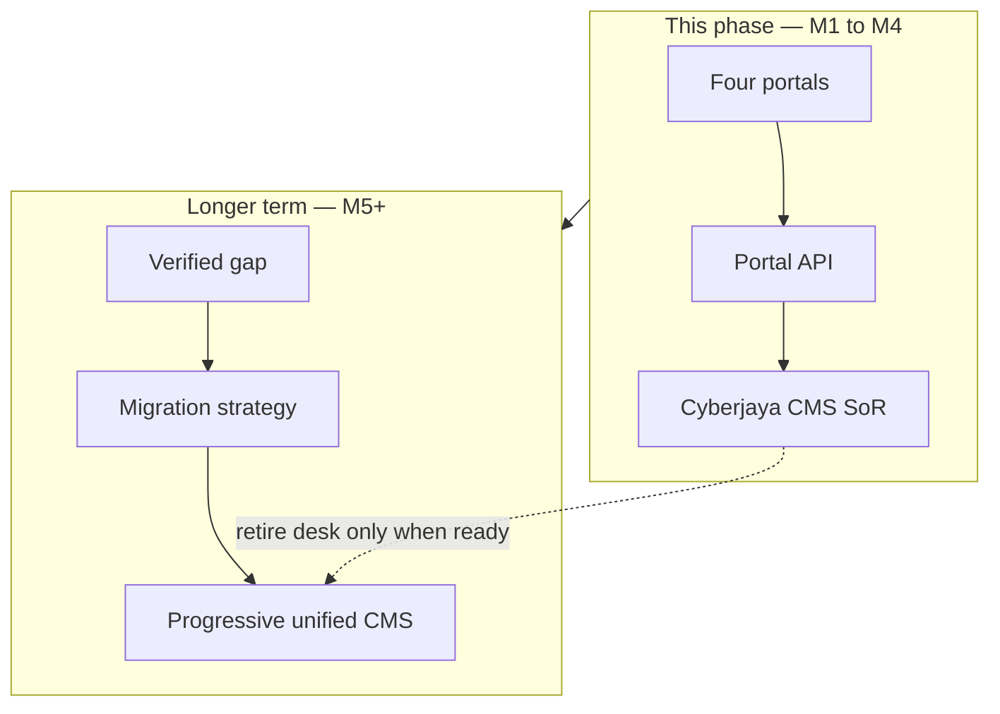

# Delivery milestones

**Document:** SDD-03  
**Status:** Working draft  
**Date:** 18 September 2026 (updated 23 September 2026)

**Nomenclature:** [M1](#m1)–[M5](#m5) anchors below. Capability IDs: [SDD-11](11-capability-catalog.md) · index [SDD-15](15-nomenclature.md).

## 1. Sequence

Milestone order follows the admissions-first decision and working-system dependencies. It is not prescribed by government. All unagreed dates remain TBC. A milestone describes when a capability **must work**, not when investigation begins.

**SoR posture across milestones:** [M1](#m1)–[M4](#m4) deliver modern portals **on** the existing Cyberjaya CMS via the Portal API (ADR-1, confirmed Aslam 23 Sep 2026). **[M5](#m5)+** is where progressive **unified one-stop CMS** consolidation may begin — only for verified gaps and with an agreed migration strategy. [M5](#m5) is not a licence to rewrite every working desk.

Kickoff: TBC. Backend commitments: TBC.

## 2. Milestone definitions

### M1 — Confirm rules and integration

| | |
|---|---|
| Target | TBC |
| Scope | Campus rules, named owners, legacy capabilities, integration access |
| Dependencies | Campus and backend owners identified; kickoff TBC |
| Release condition | Rules, API access and operating responsibilities agreed |
| Primary CAP | [CAP-42](11-capability-catalog.md#cap-42) (copyright / provider operating controls) |

This is not a UI milestone. It unblocks every later “Needs checking” row.

### M2 — Admissions launch

| | |
|---|---|
| Target | TBC |
| Scope | Applicant registration, evidence, tracking, offers, Registry review, core applicant/student sign-in, mobile shell foundations |
| Dependencies | Agreed rules; working old-CMS admissions/authentication integration |
| Release condition | Application-to-enrolment works with real records; required staff workflows available through verified old CMS or new screens |

Must work end to end:

1. Applicant account ([CAP-01](11-capability-catalog.md#cap-01)).
2. Application + documents + declarations ([CAP-02](11-capability-catalog.md#cap-02), [CAP-03](11-capability-catalog.md#cap-03), [CAP-55](11-capability-catalog.md#cap-55)).
3. Track / offer / accept ([CAP-07](11-capability-catalog.md#cap-07)).
4. Registry review, qualification checks, offer, first enrolment ([CAP-03](11-capability-catalog.md#cap-03), [CAP-05](11-capability-catalog.md#cap-05), [CAP-06](11-capability-catalog.md#cap-06), [CAP-07](11-capability-catalog.md#cap-07)).
5. Marketing communications without owning the decision ([CAP-16](11-capability-catalog.md#cap-16)).
6. Staff access via existing CMS unless a gap is verified ([CAP-44](11-capability-catalog.md#cap-44)).
7. Portal API first slice ([CAP-53](11-capability-catalog.md#cap-53)).
8. Auth, privacy, monitoring, backups ([CAP-01](11-capability-catalog.md#cap-01), [CAP-37](11-capability-catalog.md#cap-37), [CAP-38](11-capability-catalog.md#cap-38), [CAP-39](11-capability-catalog.md#cap-39)).
9. Accessible forms and mobile shell ([CAP-35](11-capability-catalog.md#cap-35), [CAP-36](11-capability-catalog.md#cap-36)).

Student portal demo screens are **not** the release condition for [M2](#m2).

### M3 — Core student portal

| | |
|---|---|
| Target | TBC |
| Scope | Learning resources, timetable, assignment delivery, policies, core records, semester registration, with lecturer and staff support |
| Dependencies | Required student, teaching, file-delivery and finance APIs; approved content; staff workflows |
| Release condition | Student and staff journeys work end to end with durable records and agreed core mobile access |

Student-only demo UI is insufficient. Lecturer publish/mark and staff approval paths for the same CAP IDs must be Live or explicitly served by the old CMS.

### M4 — Cyberjaya pilot acceptance

| | |
|---|---|
| Target | TBC |
| Scope | Test the integrated Cyberjaya pilot, train staff, obtain campus acceptance |
| Dependencies | Integrations, content, security, recovery, operational support ready |
| Release condition | Campus accepts the pilot and confirms applicable requirements, including verified existing-CMS or manual alternatives |
| Primary CAP | [CAP-41](11-capability-catalog.md#cap-41) staff training and operating readiness |

### M5 — Campus expansion and remaining CMS

| | |
|---|---|
| Target | TBC |
| Scope | Expand campus coverage; remaining approved CMS/staff capabilities; **start progressive consolidation** toward a unified one-stop CMS where gaps are verified |
| Dependencies | Cyberjaya accepted; campus-specific rules and existing capabilities verified; migration plan per domain before retiring a legacy desk |
| Release condition | Each campus accepts its rollout. Deferring new software never defers an applicable operating requirement. Any SoR move needs ownership, cutover, rollback, and training agreed |

Includes quizzes/exams, live class, library, visa, accommodation, scholarships, online payment gateway, study centres, remaining staff desks — **prefer Portal API + verified old CMS** first; rebuild or migrate only when the gap and migration strategy are explicit ([SDD-11](11-capability-catalog.md)).

## 3. Tension with current build

The student portal v1 frontend is deepest on [M3](#m3) student screens. Product priority still puts [M2](#m2) before [M3](#m3).

Design rule for the next two weeks:

1. Freeze new student demo screens unless they are on the [M2](#m2) critical path (auth, mobile shell, accessibility).
2. Prioritise [CAP-53](11-capability-catalog.md#cap-53), [CAP-01](11-capability-catalog.md#cap-01), applicant [CAP-02](11-capability-catalog.md#cap-02)/[CAP-03](11-capability-catalog.md#cap-03)/[CAP-07](11-capability-catalog.md#cap-07), and Registry old-CMS verification.
3. Keep existing student demos, but label them Demo until wired.

## 4. Definition of done (any capability)

A capability is Live only when all of the following are true:

1. Real data from the system of record, not a mock session.
2. Durable save where the user can mutate data.
3. Server-enforced permission for that role and campus.
4. The paired staff/lecturer action exists in new UI **or** is verified in the old CMS.
5. Accountable owner named.
6. Core mobile accepted if the CAP is in PRODUCT-MOBILE.
7. Country/campus operating checks in the next-action column are closed or explicitly waived.

## 5. Counts (detailed checklist)

Re-counted from the [live sheet](https://docs.google.com/spreadsheets/d/1Yux9R8hIgcPrQ5OklKd9Oyq_04qJtaAhcxJvr_7NvYI/edit?usp=sharing) on 19 September 2026. Same figures as 18 September. Progress, the sequence chart, and the open tasks are in [SDD-13](13-progress-timeline.md).

| Milestone | Rows | Dominant frontend status | Live |
|---|---|---|---|
| Confirm rules & integration | 1 | Not applicable | 0 |
| Admissions launch | 23 | Mostly not started. 4 of 18 applicable rows started, none Live | 0 |
| Core student portal | 51 | 16 started (student Demo/Partial). 35 not started, including lecturer and staff | 0 |
| Cyberjaya pilot acceptance | 1 | Not applicable (training) | 0 |
| Campus expansion & remaining CMS | 36 | 12 started. 22 applicable rows not started | 0 |

## 6. Related documents

Portal breakdowns: [SDD-04](04-applicant-portal.md) through [SDD-08](08-shared-platform.md).
