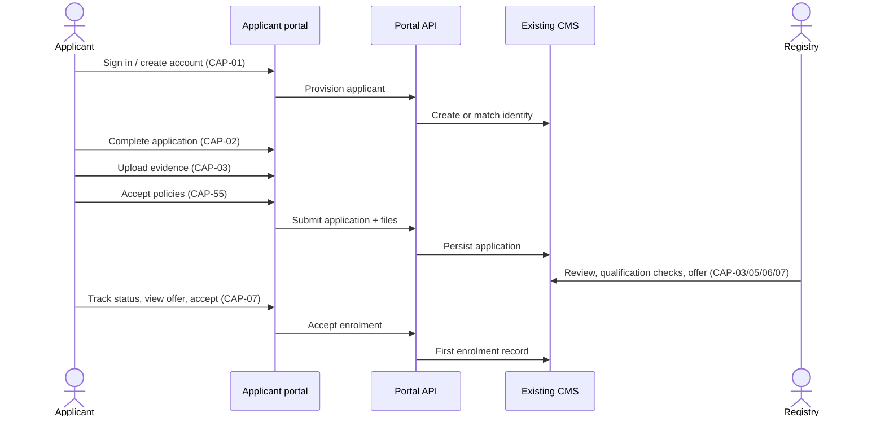

# Applicant portal

**Document:** SDD-04  
**Status:** Working draft  
**Date:** 18 September 2026  
**Milestone:** Admissions launch ([M2](03-delivery-milestones.md#m2))

## 1. Purpose

Let a prospective student create an account, submit an application with evidence and declarations, track status, view an offer, and accept enrolment. Registry remains the decision owner. Marketing may publish announcements; it does not issue offers.

## 2. Actors

- Applicant (unauthenticated visitor → authenticated applicant)
- Registry (staff, old CMS or new staff screens)
- Marketing (communications only)

## 3. Primary flow

## 4. Capabilities

| ID | Feature | Frontend | Design notes |
|---|---|---|---|
| [CAP-01](11-capability-catalog.md#cap-01) | Applicant sign-in and account access | Not started | Same identity family as student login; role = Applicant until enrolment. Confirm old CMS auth. |
| [CAP-02](11-capability-catalog.md#cap-02) | Online application form | Not started | Minimum journey and required fields per campus/programme. Campus requested. |
| [CAP-03](11-capability-catalog.md#cap-03) | Upload documents and English-entry evidence | Not started | Evidence rules are programme/country specific. Bytes must persist. |
| [CAP-07](11-capability-catalog.md#cap-07) | Track application, view offer, accept enrolment | Not started | Confirm whether old CMS already exposes this to applicants. |
| [CAP-16](11-capability-catalog.md#cap-16) | Applicant announcements and admissions updates | Not started | Campus requested. Marketing publishes; Registry owns decisions. |
| [CAP-35](11-capability-catalog.md#cap-35) | Accessible application forms and assistance | Not started | Keyboard, assistive tech, assistance path. |
| [CAP-36](11-capability-catalog.md#cap-36) | Mobile online-registration shell | Not started (mobile) | Launch requirement. Not a native app. |
| [CAP-55](11-capability-catalog.md#cap-55) | Applicant policies and declarations | Not started | Campus requested. Capture acceptance, version, timestamp. |

Staff counterparts live in [SDD-07](07-admin-staff-cms.md): [CAP-03](11-capability-catalog.md#cap-03), 05, 06, 07, 16, 44.

## 5. Data (logical)

| Entity | Key fields | Source |
|---|---|---|
| ApplicantAccount | identity, contact, auth subject | CMS / IdP |
| Application | programme, intake, campus, status | CMS |
| EvidenceObject | type, file id, checksum, uploaded at | File store + CMS metadata |
| Declaration | policy version, accepted at | CMS |
| Offer | conditions, expiry, decision | CMS |
| Enrolment | student id, programme, start | CMS |

Statuses at minimum: draft, submitted, under review, offer, accepted, enrolled, rejected, withdrawn.

## 6. Rules

- No application is complete without the campus-required evidence set for that programme.
- Foreign qualification checks ([CAP-05](11-capability-catalog.md#cap-05), 06) are staff-owned. The portal must not auto-equate credit systems.
- Offer acceptance is the only applicant action that creates first enrolment.
- Announcements never change application status.

## 7. Current baseline

No applicant signup, application, intake-choice, or application-status route exists (`src/app/routes.ts`). Enrolled-student qualification records in Profile are not an admissions flow.

## 8. Acceptance ([M2](03-delivery-milestones.md#m2))

- An applicant can complete apply → upload → declare → submit on a phone-width viewport.
- Registry can complete review → offer using verified old CMS **or** new staff screens.
- Applicant sees the same status the CMS holds.
- Files opened by Registry are the files the applicant uploaded.
- [CAP-53](11-capability-catalog.md#cap-53) admissions mapping is Live for this path.

## 9. Open blockers

Confirm minimum applicant journey, evidence matrix per programme, old-CMS applicant tracking, and account provisioning. Owners TBC.
