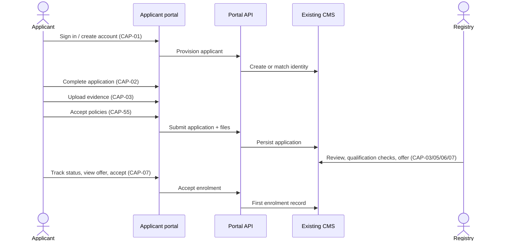

# Applicant portal

**Document:** SDD-04  
**Status:** Working draft  
**Date:** 18 September 2026  
**Milestone:** Admissions launch ([M2](03-delivery-milestones.md#m2))

## 1. Purpose

Let a prospective student create an account, submit an application with evidence and declarations, track status, view an offer, and accept enrolment. Registry remains the decision owner. Marketing may publish announcements; it does not issue offers.

## 2. Actors

- Applicant (unauthenticated visitor → authenticated applicant)
- Registry (staff, old CMS or new staff screens)
- Marketing (communications only)

## 3. Primary flow

```mermaid
sequenceDiagram
  actor A as Applicant
  participant P as Applicant portal
  participant API as Portal API
  participant CMS as Existing CMS
  actor R as Registry

  A->>P: Sign in / create account (CAP-01)
  P->>API: Provision applicant
  API->>CMS: Create or match identity
  A->>P: Complete application (CAP-02)
  A->>P: Upload evidence (CAP-03)
  A->>P: Accept policies (CAP-55)
  P->>API: Submit application + files
  API->>CMS: Persist application
  R->>CMS: Review, qualification checks, offer (CAP-03/05/06/07)
  A->>P: Track status, view offer, accept (CAP-07)
  P->>API: Accept enrolment
  API->>CMS: First enrolment record
```

## 4. Capabilities

| ID | Feature | Frontend | Design notes |
|---|---|---|---|
| [CAP-01](11-capability-catalog.md#cap-01) | Applicant sign-in and account access | Not started | Same identity family as student login; role = Applicant until enrolment. Confirm old CMS auth. |
| [CAP-02](11-capability-catalog.md#cap-02) | Online application form | Not started | Minimum journey and required fields per campus/programme. Campus requested. |
| [CAP-03](11-capability-catalog.md#cap-03) | Upload documents and English-entry evidence | Not started | Evidence rules are programme/country specific. Bytes must persist. |
| [CAP-07](11-capability-catalog.md#cap-07) | Track application, view offer, accept enrolment | Not started | Confirm whether old CMS already exposes this to applicants. |
| [CAP-16](11-capability-catalog.md#cap-16) | Applicant announcements and admissions updates | Not started | Campus requested. Marketing publishes; Registry owns decisions. |
| [CAP-35](11-capability-catalog.md#cap-35) | Accessible application forms and assistance | Not started | Keyboard, assistive tech, assistance path. |
| [CAP-36](11-capability-catalog.md#cap-36) | Mobile online-registration shell | Not started (mobile) | Launch requirement. Not a native app. |
| [CAP-55](11-capability-catalog.md#cap-55) | Applicant policies and declarations | Not started | Campus requested. Capture acceptance, version, timestamp. |

Staff counterparts live in [SDD-07](07-admin-staff-cms.md): [CAP-03](11-capability-catalog.md#cap-03), 05, 06, 07, 16, 44.

## 5. Data (logical)

| Entity | Key fields | Source |
|---|---|---|
| ApplicantAccount | identity, contact, auth subject | CMS / IdP |
| Application | programme, intake, campus, status | CMS |
| EvidenceObject | type, file id, checksum, uploaded at | File store + CMS metadata |
| Declaration | policy version, accepted at | CMS |
| Offer | conditions, expiry, decision | CMS |
| Enrolment | student id, programme, start | CMS |

Statuses at minimum: draft, submitted, under review, offer, accepted, enrolled, rejected, withdrawn.

## 6. Rules

- No application is complete without the campus-required evidence set for that programme.
- Foreign qualification checks ([CAP-05](11-capability-catalog.md#cap-05), 06) are staff-owned. The portal must not auto-equate credit systems.
- Offer acceptance is the only applicant action that creates first enrolment.
- Announcements never change application status.

## 7. Current baseline

The Applicant checkout now implements application, intake-choice, submission-status and development review routes backed by its session mock API. Real applicant signup, offers and Live admissions persistence remain unimplemented. Enrolled-student qualification records in Profile remain distinct from admissions.

Working frontend preview (2 October 2026): the unpaid fee summary uses the shared orange warning variant. Submitted Application Fee displays Transfer Proof only, while bank instructions remain in the editor. The two-row review table displays Department (Finance for Payment Proof, Registry for Document Check) as preview labels; Live reviewer routing is not implemented or confirmed by this UI. The completed Documents Checklist offers Create Application beside Edit Answers, opening the new application UI while retaining checklist state in memory. See [Applicant preview guidance](../ai/frontend/applicant-portal.md#submitted-application-ui-preview--1-october-2026).

## 8. Acceptance ([M2](03-delivery-milestones.md#m2))

- An applicant can complete apply → upload → declare → submit on a phone-width viewport.
- Registry can complete review → offer using verified old CMS **or** new staff screens.
- Applicant sees the same status the CMS holds.
- Files opened by Registry are the files the applicant uploaded.
- [CAP-53](11-capability-catalog.md#cap-53) admissions mapping is Live for this path.

## 9. Open blockers

Confirm minimum applicant journey, evidence matrix per programme, old-CMS applicant tracking, and account provisioning. Owners TBC.

**Captured Cyberjaya / LUCT baseline (6 October 2026):** public wizard + `LUCT-MKT-003` + forms pack documented in [`docs/ai/backend/luct-online-registration.md`](../ai/backend/luct-online-registration.md). Use it to close CAP-02/03/07/55 field questions for Cyberjaya; Lesotho pilot must substitute NMDS/LGCSE for Malaysia EMGS/NOC. Owners still TBC for Live fee amounts, dropdown enumerations, and Lesotho SLAs.

## Local admissions/profile increment — 5 October 2026

Applicant's existing draft/submission/messages flow now uses a validated session-only mock Portal API. Step validation presents errors beside fields and focuses the first invalid control; no page-wide validation list is shown. Student schema v4 aligns Personal, Academic and Documents through an explicitly accepted, versioned handoff; submission alone never enrols a student. Shared UI remains 0.6.1. Lesotho is the acceptance-pilot priority; existing Malaysian sample rules are retained without asserting Lesotho policy. Details: [Applicant mock API](../ai/frontend/applicant-portal/mock-api.md), [accepted handoff and backend prerequisites](../ai/backend/admissions-handoff.md). Automated local gates do not establish hosted HTTP, physical-device or CMS integration. No hosted reseed is authorized by this increment.

## Local development review increment — 5 October 2026

Applicant provides one development-only Admin Actions page with three isolated applicant scenarios (Fresh, completed unsubmitted draft, submitted approved), a shared dropdown, payment/document SummaryCards and reviewer conversation. Scenario switching retains saved work and invalidates stale operations. Payment verification precedes document verification; completion sets Approved without offers, accepted-enrolment context or Student provisioning. Admin viewing does not read messages for the applicant, and approved conversations are read-only on both sides. Production excludes the route, navigation, commands and synthetic fixtures. No HTTP/CMS integration is asserted. Details: [Applicant mock operations](../ai/frontend/applicant-portal/mock-api.md).

## Local enrolment acceptance increment — 6 October 2026

Approved Applicant applications can explicitly accept their first-preference Design enrolment through the shared confirmation popup. Submission starts with no automatic reviewer messages. The next simulated development login transfers accepted serializable data into a new isolated first-semester Student mock account/enrolment and opens existing Module Registration. Both portals use the same captured intake reference and existing curriculum/rules. No offer screens, live authentication, CMS provisioning, durable evidence transfer or backend deployment is implemented. Production and HTTP sessions exclude the simulation. Shared UI stays 0.6.1; Student schema stays 4 and admissions handoff stays version 1. See [accepted handoff](../ai/backend/admissions-handoff.md#development-browser-handoff--6-october-2026).

## Automatic post-acceptance logout — 6 October 2026

Successful enrolment acceptance now automatically logs out Applicant development mock sessions and shows the existing Sign in screen. The applicant explicitly clicks Sign in to open the existing new Student tab at Module Registration. Failed acceptance remains retryable in its popup; failed logout preserves accepted status and offers Retry Sign Out without accepting again. Session/scenario guards prevent stale transitions; records, files and drafts remain in memory until refresh. Production and HTTP sessions exclude this simulation. Shared 0.6.1, contracts and Student bootstrap remain unchanged.

## Checklist action widths — 6 October 2026

Documents Checklist uses equal-width Edit Answers and Create Application actions on phone, tablet and desktop through the existing shared PageActionBar slot. Navigation and checklist retention remain unchanged. Shared Popup trailing-action support is an unpublished candidate awaiting release authorization; Applicant still consumes 0.6.1 and its leave dialog is not yet changed.

## Shared 0.6.2 and save before leaving — 6 October 2026

Released shared 0.6.2 adds an optional trailing Popup action. Applicant uses primary Save & Close after Keep Editing to save incomplete drafts before the originally blocked navigation; pending, failure/retry, duplicate and stale-session handling remain portal-owned. Student upgrades its pin with existing defaults intact. Graph schema 4, admissions handoff 1 and Demo/Live boundaries are unchanged.

## Hosted Applicant Demo HTTP — 7 October 2026

Hosted Applicant builds with `VITE_PORTAL_API_URL` call Portal API Demo RPC (`POST /v1/auth/applicant/login`, `POST /v1/applicant/:method`). Neon stores applicant applications in `applicant_portal_state` and sessions in `poc_applicant_sessions`. Local development without the URL keeps the session-only in-process mock. Development Admin Actions and browser Student handoff simulation stay mock-only. Student graph schema remains **4**; Live CMS admissions, durable evidence bytes and operational Registry acceptance remain future work. Public contract: OpenAPI `0.4.2`. Details: [Applicant mock/HTTP API](../ai/frontend/applicant-portal/mock-api.md), [Portal API](../ai/backend/portal-api.md), [admissions handoff](../ai/backend/admissions-handoff.md).

## Campus selection and issued letters — 7 October 2026

Current local mock workflow supersedes the earlier one-confirmation acceptance increment. Shared UI stays at 0.6.2. Hosted Applicant Demo HTTP authentication and supported methods remain intact; **new campus inputs, QA/Registry letters and final enrolment acceptance are not supported by the hosted server yet**. Final acceptance is gated there rather than calling the old one-stage operation. No Portal API service, database or deployment is changed by this increment.

Step 2 requires Campus (Lesotho, Cyberjaya, Botswana, Eswatini, Sierra Leone, Cambodia, Uganda, Namibia). Alumni additionally requires a trimmed Previous Student ID. A campus change clears dependent preferences. Drafts remain saveable when incomplete. English Language Results are optional for every sample programme; populated rows must be valid. All eight campuses expose the existing Design curriculum as **demo content**, not verified campus offerings, fees or admissions policy. Selected campus metadata and frozen intake reference are retained through acceptance and Student bootstrap.

Payment Proof is reviewed by **Bursary**; Document Check by **Quality Assurance**. QA Verify Documents validates the submitted snapshot and atomically releases a generated **Eligibility Letter** PDF. The applicant's **Confirm and Continue Enrolment** popup shows the intake, faculty and programme and preview/download actions. Confirmation records intent without logout or Student provisioning. Registry's **Release Offer Letter** is enabled only afterwards. The final **Accept Enrolment** popup previews/downloads that Offer Letter. Only successful final acceptance triggers automatic logout; the applicant clicks Sign in to open the existing Student tab. Cancel changes nothing. Saving disables confirmation and dismissal; failure retains data and allows retry. Logout failure can be retried independently of acceptance. All writes retain ownership, revision, session and request-id guards.

Generated PDFs are prominently labelled DEMO, not official university letters, and contain the application reference, applicant, campus, intake, faculty, programme and release date. Original Unicode names remain canonical; the demo PDF's standard font uses a safe ASCII transliteration with replacement for unsupported glyphs. QA/Registry letters, releases and confirmations live outside the immutable submitted snapshot and are distinct from applicant-uploaded eligibility evidence. Release creates no automatic conversation or unread messages. Approved/accepted conversations remain read-only. The approved scenario now awaits Eligibility confirmation; Registry release and final acceptance remain user actions.

Admissions handoff and browser envelope **v2** include the selected campus and both letters/confirmations. The producer/consumer validate sequence and bounded PDF resources. V1 remains readable for legacy records without fabricated letters. Local generated PDF bytes travel only in the one-time validated development postMessage exchange, never URLs or persistent browser storage. Existing origin/window/nonce/replay checks and session cleanup remain. Student Documents shows issued Offer Letter first, Eligibility Letter second, with working preview/download for these resources. Other legacy documents retain their existing delivery capabilities. Payment proof remains outside Profile documents.

The selected-campus bootstrap clones only sample academic/campus configuration and remaps its IDs and local calendar windows. It creates an isolated identity/enrolment, inherits no prior results, registrations, payments or visa approvals, and preserves existing credit/fee/clash/international restrictions. Non-Cyberjaya fees and curriculum remain explicit prototype samples, not campus policy. Refresh disposes mock state and temporary resources. Durable evidence delivery, hosted two-letter methods and real CMS provisioning remain future work.

Mock operations: `confirmApplicationEligibility` (applicant), `verify-documents` with Eligibility generation (development QA command), `release-offer` (development Registry command), and guarded `acceptApplicationEnrolment` after Offer release. No new HTTP routes are exposed. Local DTOs may include optional `issuedLetter` PDF resources; hosted Profile document responses remain metadata-only.

## Review progress and letter actions — 8 October 2026

Document verification and Eligibility Letter release do not complete enrolment. The review SummaryCard stays orange (`warning`) with an **Under review** badge through Eligibility confirmation, Registry preparation and Offer release. Stage-specific headings retain the current task; only **Enrolment Accepted** uses the green completed summary.

The section is titled **Application Progress**, with **Step** as the first column and accessible table name “Application progress.” The review table has four ordered rows: Payment Proof (Bursary), Document Check (Quality Assurance), Confirm and Proceed with Enrolment (Applicant), and Prepare and Release Offer Letter (Registry). Each row derives its own Status and Update from verification/letter metadata. Document verification shows the released Eligibility filename; applicant confirmation records its date; Registry changes from awaiting applicant confirmation to preparing the Offer, then shows the released Offer filename. A completed row may be green while overall enrolment remains under review. This is presentation of existing guarded workflow state, with no API/schema changes.

Both confirmation popups and Student Documents use two equal-width letter actions with icons and spacing above them. **Preview Letter** opens a temporary PDF URL in a separate tab using the browser's PDF handling; **Download Letter** downloads the same PDF with its issued filename. There is no embedded preview popup or extra disclaimer below a viewer. The generated PDF itself retains its DEMO marking. Temporary resources retain their existing ownership/cleanup behavior. Hosted delivery support and physical-browser PDF handling remain distinct from the local mock checks.
