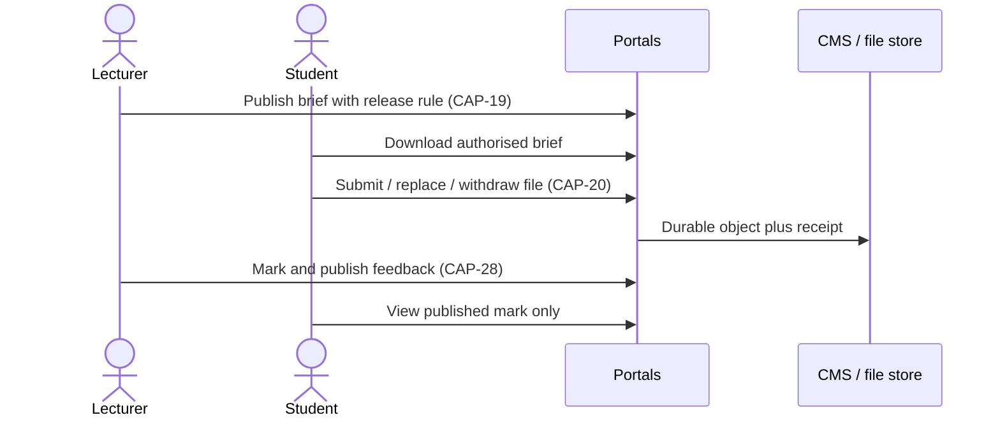

# Student portal

**Document:** SDD-05  
**Status:** Working draft  
**Date:** 18 September 2026  
**Milestones:** Auth/mobile on [M2](03-delivery-milestones.md#m2); learning/records/fees on [M3](03-delivery-milestones.md#m3); remainder on [M5](03-delivery-milestones.md#m5)

## 1. Purpose

Give an enrolled student a single web surface for identity, academic life, fees, and support. The current v1 frontend is a **demo**: screens exist; they do not save to the CMS.

This portal is not done when the student UI looks finished. Each student CAP also needs a lecturer or staff path, or a verified old-CMS equivalent.

**Agent / behaviour knowledge (canonical):** [`docs/ai/frontend/student-portal/`](../ai/frontend/student-portal/) in control-plane. Generate or refresh human docs from that tree using [`docs/ai/process/generate-documentation.md`](../ai/process/generate-documentation.md).

## 2. Actors

Student (authenticated). Upstream writers: Registry, Faculty/Lecturer, Bursary, support desks.

## 3. Information architecture

| Area | CAP IDs | Milestone |
|---|---|---|
| Account, privacy, accessibility, mobile shell | 01, 35, 36, 39 | [M2](03-delivery-milestones.md#m2) Admissions launch |
| Profile and documents | 08, 09 | [M3](03-delivery-milestones.md#m3) |
| Semester registration | 10 | [M3](03-delivery-milestones.md#m3) |
| Results | 13, 28 | [M3](03-delivery-milestones.md#m3) |
| Announcements and policies | 16, 55 | [M3](03-delivery-milestones.md#m3) |
| Fees and bank-transfer proof | 45, 46 | [M3](03-delivery-milestones.md#m3) |
| Timetable and attendance | 11, 12 | [M3](03-delivery-milestones.md#m3) |
| Study plan and course information | 14, 23 | [M3](03-delivery-milestones.md#m3) |
| Guides, notes, briefs | 17, 18, 19 | [M3](03-delivery-milestones.md#m3) |
| Assignment submit | 20 | [M3](03-delivery-milestones.md#m3) |
| Past papers / revision | 21, 22 | [M3](03-delivery-milestones.md#m3) |
| Integrity guidance | 29 | [M3](03-delivery-milestones.md#m3) |
| Orientation, helpdesk | 32, 33 | [M3](03-delivery-milestones.md#m3) |
| Graduation / transcripts | 15 | [M5](03-delivery-milestones.md#m5) |
| Online payment, scholarships | 47, 48 | [M5](03-delivery-milestones.md#m5) |
| Quizzes/exams, live class, self-paced | 24, 26, 27 | [M5](03-delivery-milestones.md#m5) |
| Communication | 25 | [M5](03-delivery-milestones.md#m5) |
| Library, study centres | 31, 34 | [M5](03-delivery-milestones.md#m5) |
| Resume/portfolio, visa, requests, housing, services | 49–52, 54 | [M5](03-delivery-milestones.md#m5) |
| Course evaluation | 30 | [M5](03-delivery-milestones.md#m5) |

Campus-requested student features: timetable, announcements, study guides, notes, briefs, assignment submit, revision, past papers, policies.

## 4. Key flows

### 4.1 Registration and fees

```mermaid
sequenceDiagram
  actor S as Student
  participant P as Student portal
  participant API as Portal API
  participant CMS as Existing CMS
  actor B as Bursary

  S->>P: Select modules (CAP-10)
  P->>API: Validate rules atomically
  API->>CMS: Registration transaction
  CMS-->>P: Invoice / balance (CAP-45)
  S->>P: Submit bank-transfer proof (CAP-46)
  P->>API: Store file metadata plus bytes
  B->>CMS: Verify proof; allocate payment
  Note over P,CMS: Proof is never payment until Bursary allocates
```

### 4.2 Assignment handoff



## 5. Design rules

1. **Edits vs approvals ([CAP-08](11-capability-catalog.md#cap-08)).** Some profile fields save directly; others raise a staff task. The split is a Registry policy, not a UI guess.
2. **Documents ([CAP-09](11-capability-catalog.md#cap-09)).** View/Download must deliver files. No-op buttons stay Placeholder.
3. **Registration ([CAP-10](11-capability-catalog.md#cap-10))** is semester registration against legacy rules, not admissions. Atomic save: clash, credit, prerequisite checks in one CMS transaction.
4. **Results ([CAP-13](11-capability-catalog.md#cap-13), 28)** show only published results. Marking is lecturer/staff.
5. **Announcements ([CAP-16](11-capability-catalog.md#cap-16))** need a real feed, audience, and open/detail action. Preview cards without an open action are Partial.
6. **Fees ([CAP-45](11-capability-catalog.md#cap-45), 46).** Ledger from CMS. Fictional banking details must not ship. Proof upload is metadata **and** bytes; staff verification is a separate state.
7. **Learning files ([CAP-17](11-capability-catalog.md#cap-17)–22)** require lecturer publish + authorised student access. A generic Materials list of no-op rows is not delivery.
8. **Chat ([CAP-25](11-capability-catalog.md#cap-25))** is not Live while messages stay in one mock session.
9. **Immigration ([CAP-50](11-capability-catalog.md#cap-50))** is case management, not a blank page or a mock eligibility widget.

## 6. Current baseline (selected)

From BASE-01…BASE-55. Full list in [SDD-09](09-requirements-traceability.md).

| CAP | What exists now |
|---|---|
| 01 | Shell and fixed mock student session; logout no-op |
| 08 | Contact edits in one mock session |
| 09 | File lists; View/Download no-op |
| 10 | Mock module selection and mock invoices |
| 11 | Read-only mock timetable |
| 13 | Sample GPA/results; no publication workflow |
| 16 | Dashboard preview cards; no detail, no publishing |
| 20 | Submit demo stores metadata only; bytes never uploaded |
| 25 | Chat in one mock session |
| 36 | Whole-portal mobile not accepted |
| 45–46 | Mock ledger; fictional bank details; proof metadata only |
| 51–52 | Requests and Accommodation blank |
| 53 | Contracts exist; no live CMS adapter |

Simplified “Frontend ready” on these rows is Demo or Partial. Do not report them as complete in the working group.

## 7. Remaining frontend estimates (student only)

From the simplified sheet, not a commitment:

| CAP | Effort | Status |
|---|---|---|
| [CAP-01](11-capability-catalog.md#cap-01) | 1 day | Placeholder |
| [CAP-21](11-capability-catalog.md#cap-21), 22 | 3 days | Not started |
| [CAP-24](11-capability-catalog.md#cap-24) | 2 days | Placeholder |
| [CAP-26](11-capability-catalog.md#cap-26) | 3 days | Not started |
| [CAP-30](11-capability-catalog.md#cap-30) | 2 days | Placeholder |
| [CAP-52](11-capability-catalog.md#cap-52) | 3 days | Placeholder |

Wiring and CMS work is separate and larger.

## 8. Acceptance ([M3](03-delivery-milestones.md#m3) student slice)

For each in-scope CAP:

- Student action persists in CMS or file store.
- Matching lecturer/staff action is Live or verified in old CMS.
- No sample ledger, no fictional bank, no mock session identity.
- Core mobile CAPs accepted on phone widths.

## 9. Related documents

Lecturer pair: [SDD-06](06-lecturer-portal.md). Staff pair: [SDD-07](07-admin-staff-cms.md). Catalogue: [SDD-11](11-capability-catalog.md).
