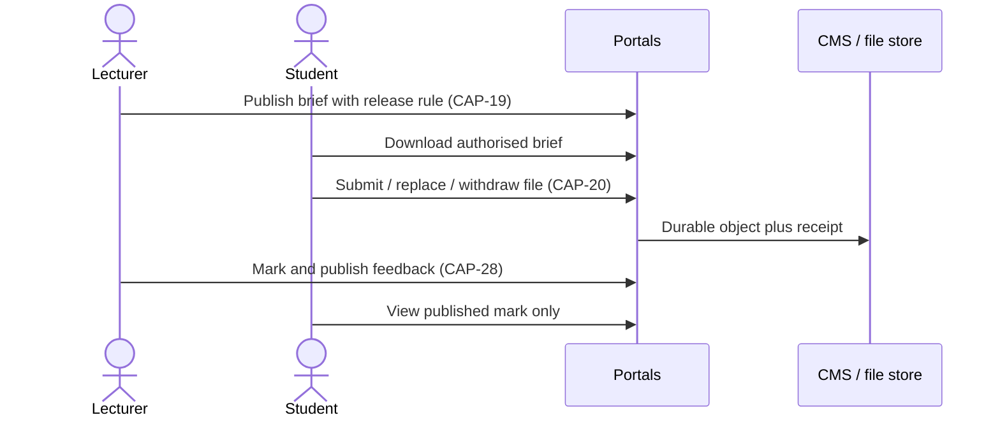

# Student portal

**Document:** SDD-05  
**Status:** Working draft  
**Date:** 18 September 2026  
**Milestones:** Auth/mobile on [M2](03-delivery-milestones.md#m2); learning/records/fees on [M3](03-delivery-milestones.md#m3); remainder on [M5](03-delivery-milestones.md#m5)

## 1. Purpose

Give an enrolled student a single web surface for identity, academic life, fees, and support. The current v1 frontend is a **demo**: screens exist; they do not save to the CMS.

This portal is not done when the student UI looks finished. Each student CAP also needs a lecturer or staff path, or a verified old-CMS equivalent.

**Agent / behaviour knowledge (canonical):** [`docs/ai/frontend/student-portal/`](../ai/frontend/student-portal/) in control-plane. Generate or refresh human docs from that tree using [`docs/ai/process/generate-documentation.md`](../ai/process/generate-documentation.md).

## 2. Actors

Student (authenticated). Upstream writers: Registry, Faculty/Lecturer, Bursary, support desks.

## 3. Information architecture

| Area | CAP IDs | Milestone |
|---|---|---|
| Account, privacy, accessibility, mobile shell | 01, 35, 36, 39 | [M2](03-delivery-milestones.md#m2) Admissions launch |
| Profile and documents | 08, 09 | [M3](03-delivery-milestones.md#m3) |
| Semester registration | 10 | [M3](03-delivery-milestones.md#m3) |
| Results | 13, 28 | [M3](03-delivery-milestones.md#m3) |
| Announcements and policies | 16, 55 | [M3](03-delivery-milestones.md#m3) |
| Fees and bank-transfer proof | 45, 46 | [M3](03-delivery-milestones.md#m3) |
| Timetable and attendance | 11, 12 | [M3](03-delivery-milestones.md#m3) |
| Study plan and course information | 14, 23 | [M3](03-delivery-milestones.md#m3) |
| Guides, notes, briefs | 17, 18, 19 | [M3](03-delivery-milestones.md#m3) |
| Assignment submit | 20 | [M3](03-delivery-milestones.md#m3) |
| Past papers / revision | 21, 22 | [M3](03-delivery-milestones.md#m3) |
| Integrity guidance | 29 | [M3](03-delivery-milestones.md#m3) |
| Orientation, helpdesk | 32, 33 | [M3](03-delivery-milestones.md#m3) |
| Graduation / transcripts | 15 | [M5](03-delivery-milestones.md#m5) |
| Online payment, scholarships | 47, 48 | [M5](03-delivery-milestones.md#m5) |
| Quizzes/exams, live class, self-paced | 24, 26, 27 | [M5](03-delivery-milestones.md#m5) |
| Communication | 25 | [M5](03-delivery-milestones.md#m5) |
| Library, study centres | 31, 34 | [M5](03-delivery-milestones.md#m5) |
| Resume/portfolio, visa, requests, housing, services | 49–52, 54 | [M5](03-delivery-milestones.md#m5) |
| Course evaluation | 30 | [M5](03-delivery-milestones.md#m5) |

Campus-requested student features: timetable, announcements, study guides, notes, briefs, assignment submit, revision, past papers, policies.

## 4. Key flows

### 4.1 Registration and fees

```mermaid
sequenceDiagram
  actor S as Student
  participant P as Student portal
  participant API as Portal API
  participant CMS as Existing CMS
  actor B as Bursary

  S->>P: Select modules (CAP-10)
  P->>API: Validate rules atomically
  API->>CMS: Registration transaction
  CMS-->>P: Invoice / balance (CAP-45)
  S->>P: Submit bank-transfer proof (CAP-46)
  P->>API: Store file metadata plus bytes
  B->>CMS: Verify proof; allocate payment
  Note over P,CMS: Proof is never payment until Bursary allocates
```

### 4.2 Assignment handoff

```mermaid
sequenceDiagram
  actor L as Lecturer
  actor S as Student
  participant P as Portals
  participant CMS as CMS / file store

  L->>P: Publish brief with release rule (CAP-19)
  S->>P: Download authorised brief
  S->>P: Submit / replace / withdraw file (CAP-20)
  P->>CMS: Durable object plus receipt
  L->>P: Mark and publish feedback (CAP-28)
  S->>P: View published mark only
```

## 5. Design rules

1. **Edits vs approvals ([CAP-08](11-capability-catalog.md#cap-08)).** Some profile fields save directly; others raise a staff task. The split is a Registry policy, not a UI guess.
2. **Documents ([CAP-09](11-capability-catalog.md#cap-09)).** View/Download must deliver files. No-op buttons stay Placeholder.
3. **Registration ([CAP-10](11-capability-catalog.md#cap-10))** is semester registration against legacy rules, not admissions. Atomic save: clash, credit, prerequisite checks in one CMS transaction.
4. **Results ([CAP-13](11-capability-catalog.md#cap-13), 28)** show only published results. Marking is lecturer/staff.
5. **Announcements ([CAP-16](11-capability-catalog.md#cap-16))** need a real feed, audience, and open/detail action. Preview cards without an open action are Partial.
6. **Fees ([CAP-45](11-capability-catalog.md#cap-45), 46).** Ledger from CMS. Fictional banking details must not ship. Proof upload is metadata **and** bytes; staff verification is a separate state.
7. **Learning files ([CAP-17](11-capability-catalog.md#cap-17)–22)** require lecturer publish + authorised student access. A generic Materials list of no-op rows is not delivery.
8. **Chat ([CAP-25](11-capability-catalog.md#cap-25))** is not Live while messages stay in one mock session.
9. **Immigration ([CAP-50](11-capability-catalog.md#cap-50))** is case management, not a blank page or a mock eligibility widget.

## 6. Current baseline (selected)

From BASE-01…BASE-55. Full list in [SDD-09](09-requirements-traceability.md).

| CAP | What exists now |
|---|---|
| 01 | Shell and fixed mock student session; logout no-op |
| 08 | Contact edits in one mock session |
| 09 | File lists; View/Download no-op |
| 10 | Mock module selection and mock invoices |
| 11 | Read-only mock timetable |
| 13 | Sample GPA/results; no publication workflow |
| 16 | Dashboard preview cards; no detail, no publishing |
| 20 | Submit demo stores metadata only; bytes never uploaded |
| 25 | Chat in one mock session |
| 36 | Whole-portal mobile not accepted |
| 45–46 | Mock ledger; fictional bank details; proof metadata only |
| 51–52 | Requests and Accommodation blank |
| 53 | Contracts exist; no live CMS adapter |

Simplified “Frontend ready” on these rows is Demo or Partial. Do not report them as complete in the working group.

## 7. Remaining frontend estimates (student only)

From the simplified sheet, not a commitment:

| CAP | Effort | Status |
|---|---|---|
| [CAP-01](11-capability-catalog.md#cap-01) | 1 day | Placeholder |
| [CAP-21](11-capability-catalog.md#cap-21), 22 | 3 days | Not started |
| [CAP-24](11-capability-catalog.md#cap-24) | 2 days | Placeholder |
| [CAP-26](11-capability-catalog.md#cap-26) | 3 days | Not started |
| [CAP-30](11-capability-catalog.md#cap-30) | 2 days | Placeholder |
| [CAP-52](11-capability-catalog.md#cap-52) | 3 days | Placeholder |

Wiring and CMS work is separate and larger.

## 8. Acceptance ([M3](03-delivery-milestones.md#m3) student slice)

For each in-scope CAP:

- Student action persists in CMS or file store.
- Matching lecturer/staff action is Live or verified in old CMS.
- No sample ledger, no fictional bank, no mock session identity.
- Core mobile CAPs accepted on phone widths.

## 9. Related documents

Lecturer pair: [SDD-06](06-lecturer-portal.md). Staff pair: [SDD-07](07-admin-staff-cms.md). Catalogue: [SDD-11](11-capability-catalog.md).

## Local admissions/profile increment — 5 October 2026

Applicant's existing draft/submission/messages flow now uses a validated session-only mock Portal API. Student schema v4 aligns Personal, Academic and Documents through an explicitly accepted, versioned handoff; submission alone never enrols a student. Shared UI remains 0.6.1. Lesotho is the acceptance-pilot priority; existing Malaysian sample rules are retained without asserting Lesotho policy. Details: [Applicant mock API](../ai/frontend/applicant-portal/mock-api.md), [accepted handoff and backend prerequisites](../ai/backend/admissions-handoff.md). Automated local gates do not establish hosted HTTP, physical-device or CMS integration. No hosted reseed is authorized by this increment.

## Local enrolment acceptance increment — 6 October 2026

Approved Applicant applications can explicitly accept their first-preference Design enrolment through the shared confirmation popup. Submission starts with no automatic reviewer messages. The next simulated development login transfers accepted serializable data into a new isolated first-semester Student mock account/enrolment and opens existing Module Registration. Both portals use the same captured intake reference and existing curriculum/rules. No offer screens, live authentication, CMS provisioning, durable evidence transfer or backend deployment is implemented. Production and HTTP sessions exclude the simulation. Shared UI stays 0.6.1; Student schema stays 4 and admissions handoff stays version 1. See [accepted handoff](../ai/backend/admissions-handoff.md#development-browser-handoff--6-october-2026).

## Automatic post-acceptance logout — 6 October 2026

Successful enrolment acceptance now automatically logs out Applicant development mock sessions and shows the existing Sign in screen. The applicant explicitly clicks Sign in to open the existing new Student tab at Module Registration. Failed acceptance remains retryable in its popup; failed logout preserves accepted status and offers Retry Sign Out without accepting again. Session/scenario guards prevent stale transitions; records, files and drafts remain in memory until refresh. Production and HTTP sessions exclude this simulation. Shared 0.6.1, contracts and Student bootstrap remain unchanged.

## Document order and expandable navigation labels — 6 October 2026

Profile Documents displays the existing Enrolment Confirmation sample as Offer Letter and places it first, followed by the existing alphabetical list. Stored classification, owners, IDs and filenames are retained, so the display alias does not supply new Immigration evidence. Expandable sidebar triggers compose the existing shared PortalNavItem white label treatment while retaining expansion and routing. Shared package remains 0.6.1.

## Shared 0.6.2 and save before leaving — 6 October 2026

Released shared 0.6.2 adds an optional trailing Popup action. Applicant uses primary Save & Close after Keep Editing to save incomplete drafts before the originally blocked navigation; pending, failure/retry, duplicate and stale-session handling remain portal-owned. Student upgrades its pin with existing defaults intact. Graph schema 4, admissions handoff 1 and Demo/Live boundaries are unchanged.

## Hosted Portal API schema v4 + Applicant Demo HTTP — 7 October 2026

Hosted Portal API Demo now reports `/v1/meta.schemaVersion` **4** (Student engine aligned to admissions profile fields) and exposes Applicant Demo RPC beside existing Student RPC. A Neon backup preceded the schema-mismatch reseed; overlays/`student_portal_state` and `audit_events` were retained. Student SPA behaviour is unchanged aside from reseeded Demo fixtures. Live CMS writes remain out of scope. Details: [Portal API](../ai/backend/portal-api.md), [admissions handoff](../ai/backend/admissions-handoff.md).

## Campus selection and issued letters — 7 October 2026

Current local mock workflow supersedes the earlier one-confirmation acceptance increment. Shared UI stays at 0.6.2. Hosted Applicant Demo HTTP authentication remains intact. The incoming 9 October backend documentation reports ten RPC methods, including Eligibility confirmation and final acceptance, with automatic Demo Offer release. This frontend checkout still explicitly gates hosted confirmation/acceptance; enabling and verifying that frontend parity is separate work. Staff-owned Offer release, durable authorized Student file delivery and Live CMS writes remain pending. This local increment does not alter Portal API service code or database records.

Step 2 requires Campus (Lesotho, Cyberjaya, Botswana, Eswatini, Sierra Leone, Cambodia, Uganda, Namibia). Alumni additionally requires a trimmed Previous Student ID. A campus change clears dependent preferences. Drafts remain saveable when incomplete. English Language Results are optional for every sample programme; populated rows must be valid. All eight campuses expose the existing Design curriculum as **demo content**, not verified campus offerings, fees or admissions policy. Selected campus metadata and frozen intake reference are retained through acceptance and Student bootstrap.

Payment Proof is reviewed by **Bursary**; Document Check by **Quality Assurance**. QA Verify Documents validates the submitted snapshot and atomically releases a generated **Eligibility Letter** PDF. The applicant's **Confirm and Continue Enrolment** popup shows the intake, faculty and programme and preview/download actions. Confirmation records intent without logout or Student provisioning. Registry's **Release Offer Letter** is enabled only afterwards. The final **Accept Enrolment** popup previews/downloads that Offer Letter. Only successful final acceptance triggers automatic logout; the applicant clicks Sign in to open the existing Student tab. Cancel changes nothing. Saving disables confirmation and dismissal; failure retains data and allows retry. Logout failure can be retried independently of acceptance. All writes retain ownership, revision, session and request-id guards.

Generated PDFs are prominently labelled DEMO, not official university letters, and contain the application reference, applicant, campus, intake, faculty, programme and release date. Original Unicode names remain canonical; the demo PDF's standard font uses a safe ASCII transliteration with replacement for unsupported glyphs. QA/Registry letters, releases and confirmations live outside the immutable submitted snapshot and are distinct from applicant-uploaded eligibility evidence. Release creates no automatic conversation or unread messages. Approved/accepted conversations remain read-only. The approved scenario now awaits Eligibility confirmation; Registry release and final acceptance remain user actions.

Admissions handoff and browser envelope **v2** include the selected campus and both letters/confirmations. The producer/consumer validate sequence and bounded PDF resources. V1 remains readable for legacy records without fabricated letters. Local generated PDF bytes travel only in the one-time validated development postMessage exchange, never URLs or persistent browser storage. Existing origin/window/nonce/replay checks and session cleanup remain. Student Documents shows issued Offer Letter first, Eligibility Letter second, with working preview/download for these resources. Other legacy documents retain their existing delivery capabilities. Payment proof remains outside Profile documents.

The selected-campus bootstrap clones only sample academic/campus configuration and remaps its IDs and local calendar windows. It creates an isolated identity/enrolment, inherits no prior results, registrations, payments or visa approvals, and preserves existing credit/fee/clash/international restrictions. Non-Cyberjaya fees and curriculum remain explicit prototype samples, not campus policy. Refresh disposes mock state and temporary resources. Durable evidence delivery, hosted two-letter methods and real CMS provisioning remain future work.

Mock operations: `confirmApplicationEligibility` (applicant), `verify-documents` with Eligibility generation (development QA command), `release-offer` (development Registry command), and guarded `acceptApplicationEnrolment` after Offer release. No new HTTP routes are exposed. Local DTOs may include optional `issuedLetter` PDF resources; hosted Profile document responses remain metadata-only.

## Review progress and letter actions — 8 October 2026

Document verification and Eligibility Letter release do not complete enrolment. The review SummaryCard stays orange (`warning`) with an **Under review** badge through Eligibility confirmation, Registry preparation and Offer release. Stage-specific headings retain the current task; only **Enrolment Accepted** uses the green completed summary.

The review table has four ordered rows: Payment Proof (Bursary), Document Check (Quality Assurance), Confirm and Proceed with Enrolment (Applicant), and Prepare and Release Offer Letter (Registry). Each row derives its own Status and Update from verification/letter metadata. Document verification shows the released Eligibility filename; applicant confirmation records its date; Registry changes from awaiting applicant confirmation to preparing the Offer, then shows the released Offer filename. A completed row may be green while overall enrolment remains under review. This is presentation of existing guarded workflow state, with no API/schema changes.

Both confirmation popups and Student Documents use two equal-width letter actions with icons and spacing above them. **Preview Letter** opens a temporary PDF URL in a separate tab using the browser's PDF handling; **Download Letter** downloads the same PDF with its issued filename. There is no embedded preview popup or extra disclaimer below a viewer. The generated PDF itself retains its DEMO marking. Temporary resources retain their existing ownership/cleanup behavior. Hosted delivery support and physical-browser PDF handling remain distinct from the local mock checks.

## Source forms and departmental workflows — 8 October 2026

The approved local specification is [Student workflows](../ai/frontend/student-portal/student-workflows.md): source-aligned Registry forms and versioned Student Feedback, Bursary then Faculty module-registration approval, automatic gated standard documents, native file viewers, Lesotho-only LSL/NMDS and Cyberjaya health declarations. Admissions snapshot v2 is retained while DEV browser transport v3 carries actual owned evidence. Hosted capability support, official tariffs/templates and physical-device behavior remain separate Live inputs.
