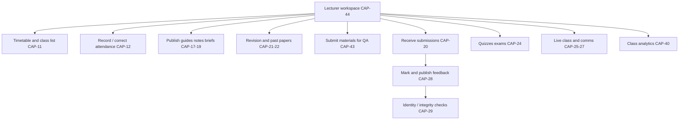

# Lecturer portal

**Document:** SDD-06  
**Status:** Working draft  
**Date:** 18 September 2026  
**Milestones:** Core teaching on [M3](03-delivery-milestones.md#m3); live class, quizzes, analytics on [M5](03-delivery-milestones.md#m5)

## 1. Purpose

Give lecturers the write-side of student learning: timetable and attendance, content publishing, assignment receipt and marking, and (later) live teaching and class analytics.

There is **no lecturer application** in the current baseline (`src/app/routes.ts`). Student Materials is not an LMS.

## 2. Actors

Lecturer. QA reviews materials ([CAP-43](11-capability-catalog.md#cap-43)). Faculty staff schedule classes ([CAP-11](11-capability-catalog.md#cap-11) staff). Examinations/QA own integrity policy ([CAP-29](11-capability-catalog.md#cap-29)).

## 3. Primary flows

Campus-requested lecturer work: timetable/attendance, content publishing, assessment review/marking/integrity.

## 4. Capabilities

### [M3](03-delivery-milestones.md#m3) — required to make student learning Live

| ID | Feature | Frontend | Design notes |
|---|---|---|---|
| [CAP-44](11-capability-catalog.md#cap-44) | Lecturer workspace and course access | Not started | Course-scoped home. Confirm old CMS already has this. |
| [CAP-11](11-capability-catalog.md#cap-11) | View teaching timetable and allocations | Not started | Same schedule students see. |
| [CAP-12](11-capability-catalog.md#cap-12) | Record and correct attendance | Not started | Authoritative write; student view is read-only. |
| [CAP-17](11-capability-catalog.md#cap-17) | Publish study guides | Not started | Version, release date, authorised audience. |
| [CAP-18](11-capability-catalog.md#cap-18) | Publish lecture notes and media | Not started | Real bytes; student download must work. |
| [CAP-19](11-capability-catalog.md#cap-19) | Publish assignment briefs and deadlines | Not started | Brief file is the contract for [CAP-20](11-capability-catalog.md#cap-20). |
| [CAP-21](11-capability-catalog.md#cap-21) | Publish revision / practice | Not started | Campus requested. |
| [CAP-22](11-capability-catalog.md#cap-22) | Prepare past papers for authorised publication | Not started | Faculty/exams approve access (staff [CAP-22](11-capability-catalog.md#cap-22)). |
| [CAP-23](11-capability-catalog.md#cap-23) | Maintain course information and outcomes | Not started | Structured outcomes, not only a module blurb. |
| [CAP-43](11-capability-catalog.md#cap-43) | Submit course materials for quality review | Not started | QA counterpart in staff portal. |
| [CAP-20](11-capability-catalog.md#cap-20) | Receive and review submitted assignments | Not started | Must see the same object the student uploaded. |
| [CAP-28](11-capability-catalog.md#cap-28) | Mark and publish feedback | Not started | Students see marks only after publication. |
| [CAP-29](11-capability-catalog.md#cap-29) | Identity and integrity checks | Not started | Per assessment mode; not a student-only banner. |

### [M5](03-delivery-milestones.md#m5) — later

| ID | Feature | Notes |
|---|---|---|
| [CAP-24](11-capability-catalog.md#cap-24) | Quizzes and examinations | Attempts, approval, integrity |
| [CAP-25](11-capability-catalog.md#cap-25) | Communicate with teaching groups | Persistent, not mock session |
| [CAP-26](11-capability-catalog.md#cap-26) | Live online classes | Approved meeting tool; may be a launch link |
| [CAP-27](11-capability-catalog.md#cap-27) | Self-paced release schedules | Completion rules |
| [CAP-40](11-capability-catalog.md#cap-40) | Class learning analytics | Not the student GPA widget |
| [CAP-36](11-capability-catalog.md#cap-36) | Mobile lecturer workspace | Not a launch mandate |

## 5. Rules

- A resource is not published until it has an audience, release rule, and file or URL that students can actually open.
- Past papers need publication permission (staff [CAP-22](11-capability-catalog.md#cap-22)). Lecturer “prepare” ≠ public.
- Marking publication is a deliberate action. Draft marks stay staff-only.
- Attendance corrections are staff/lecturer writes with audit, not student self-marking.
- If the old CMS already supports a lecturer workflow, do not rebuild it; deep-link or verify and tick Needs checking to Live.

## 6. Current baseline

No staff or lecturer routes. Student-facing Materials, mock chat, and displayed historic grades do not satisfy this portal.

## 7. Acceptance ([M3](03-delivery-milestones.md#m3) lecturer slice)

- Lecturer can publish a brief and a student can download it.
- Lecturer can receive a real uploaded assignment and return a published mark.
- Lecturer can record attendance that the student timetable/attendance view then shows.
- Workspace is course-scoped and authenticated as a lecturer, not a mocked student.

## 8. Related documents

Student pair: [SDD-05](05-student-portal.md). QA/Faculty staff: [SDD-07](07-admin-staff-cms.md).
