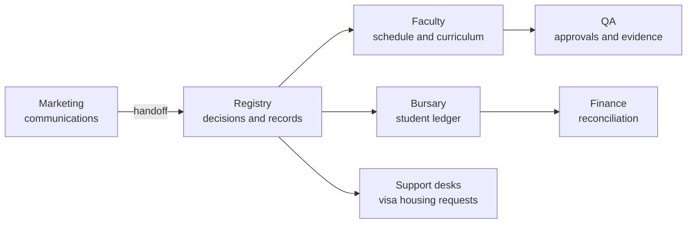

# Admin / staff CMS

**Document:** SDD-07  
**Status:** Working draft  
**Date:** 18 September 2026

## 1. Purpose

Staff tools for running the campus: Registry, Faculty, Bursary/Finance, Quality Assurance, Marketing, and remaining operational desks. **Build new screens only for verified gaps.** If the old CMS already runs the workflow, the portal may deep-link or omit the screen and still mark the capability Live once verified.

## 2. Design rule ([CAP-44](11-capability-catalog.md#cap-44))

Confirm existing-CMS staff access for admissions first. A new administrator chrome is not a prerequisite for [M2](03-delivery-milestones.md#m2) if Registry can already issue offers in the old CMS.

## 3. Department map

## 4. Registry

| IDs | Milestone | Staff job |
|---|---|---|
| [CAP-03](11-capability-catalog.md#cap-03), 05, 06, 07 | [M2](03-delivery-milestones.md#m2) | Review evidence, qualification/credits, foreign equivalency, offer, first enrolment |
| [CAP-08](11-capability-catalog.md#cap-08), 09 | [M3](03-delivery-milestones.md#m3) | Student master, emergency contacts, document permissions |
| [CAP-10](11-capability-catalog.md#cap-10) | [M3](03-delivery-milestones.md#m3) | Configure and approve semester registration |
| [CAP-13](11-capability-catalog.md#cap-13) | [M3](03-delivery-milestones.md#m3) | Approve and release results |
| [CAP-16](11-capability-catalog.md#cap-16), 55 | [M3](03-delivery-milestones.md#m3) | Announce and publish policies (campus requested) |
| [CAP-15](11-capability-catalog.md#cap-15) | [M5](03-delivery-milestones.md#m5) | Graduation and official transcripts |

Rules:

- Marketing publishes recruitment copy; Registry owns formal application decisions.
- Foreign awards are never auto-equivalent ([CAP-05](11-capability-catalog.md#cap-05), 06).
- Result release is a Registry/exams action; student GPA views must not show unreleased marks.

## 5. Faculty

| IDs | Milestone | Staff job |
|---|---|---|
| [CAP-11](11-capability-catalog.md#cap-11) | [M3](03-delivery-milestones.md#m3) | Schedule classes, lecturers, rooms (campus requested) |
| [CAP-14](11-capability-catalog.md#cap-14), 23 | [M3](03-delivery-milestones.md#m3) | Study plans, prerequisites, outcomes |
| [CAP-22](11-capability-catalog.md#cap-22) | [M3](03-delivery-milestones.md#m3) | Past-paper publication rights (campus requested) |
| [CAP-24](11-capability-catalog.md#cap-24) | [M5](03-delivery-milestones.md#m5) | Exam administration and approved arrangements |

The lecturer portal is the day-to-day teaching surface; Faculty staff own the timetable grid and programme rules.

## 6. Bursary and Finance

| IDs | Milestone | Staff job |
|---|---|---|
| [CAP-45](11-capability-catalog.md#cap-45) | [M3](03-delivery-milestones.md#m3) | Invoices, balances, payment records |
| [CAP-46](11-capability-catalog.md#cap-46) | [M3](03-delivery-milestones.md#m3) | Verify bank-transfer proofs; allocate; Finance reconciles |
| [CAP-47](11-capability-catalog.md#cap-47) | [M5](03-delivery-milestones.md#m5) | Online payment reconciliation and financial documents |
| [CAP-48](11-capability-catalog.md#cap-48) | [M5](03-delivery-milestones.md#m5) | Scholarships and incentives |

Rule: a student proof ([CAP-46](11-capability-catalog.md#cap-46)) does not change the ledger until Bursary verifies it. Finance owns reconciliation and official documents; Bursary owns the student account handoff.

## 7. Quality Assurance

| IDs | Milestone | Staff job |
|---|---|---|
| [CAP-04](11-capability-catalog.md#cap-04) | [M2](03-delivery-milestones.md#m2) | Institution, programme, delivery-site approvals for intended campuses |
| [CAP-42](11-capability-catalog.md#cap-42), 43 | [M3](03-delivery-milestones.md#m3) | Copyright/provider permissions; material approval; LMS-readiness evidence |
| [CAP-30](11-capability-catalog.md#cap-30), 40 | [M5](03-delivery-milestones.md#m5) | Evaluations, confidentiality, institutional analytics |

[CAP-04](11-capability-catalog.md#cap-04) is an admissions-launch dependency: do not take applications for a programme/site that is not recorded as approved.

## 8. Marketing

[CAP-16](11-capability-catalog.md#cap-16) ([M2](03-delivery-milestones.md#m2)): publish recruitment and applicant communications. No status change on applications.

## 9. Remaining desks ([M5](03-delivery-milestones.md#m5))

| IDs | Desk |
|---|---|
| [CAP-31](11-capability-catalog.md#cap-31) | Digital library licences |
| [CAP-32](11-capability-catalog.md#cap-32) | Orientation content |
| [CAP-33](11-capability-catalog.md#cap-33) | Learner support / IT helpdesk |
| [CAP-34](11-capability-catalog.md#cap-34) | Study-centre coordination |
| [CAP-35](11-capability-catalog.md#cap-35) | Accessibility arrangements |
| [CAP-36](11-capability-catalog.md#cap-36) | Mobile staff workspace (not launch) |
| [CAP-49](11-capability-catalog.md#cap-49) | Career / portfolio guidance |
| [CAP-50](11-capability-catalog.md#cap-50) | Immigration / visa cases |
| [CAP-51](11-capability-catalog.md#cap-51) | Requests, complaints, appeals |
| [CAP-52](11-capability-catalog.md#cap-52) | Accommodation allocation |
| [CAP-54](11-capability-catalog.md#cap-54) | Campus services information |

## 10. Current baseline

No staff application. Suggested next-action roles in BASE-* rows are hints, not named owners. Every staff row is Not started except [CAP-36](11-capability-catalog.md#cap-36) Not applicable.

## 11. Acceptance

- [M2](03-delivery-milestones.md#m2): Registry can complete application-to-enrolment on verified old CMS or new screens; [CAP-04](11-capability-catalog.md#cap-04) evidence collected for Cyberjaya programmes.
- [M3](03-delivery-milestones.md#m3): Registration, result release, billing verification, timetable administration, and content approval each have a named Live path.
- Do not open a parallel staff UI that double-enters data the old CMS already holds.
