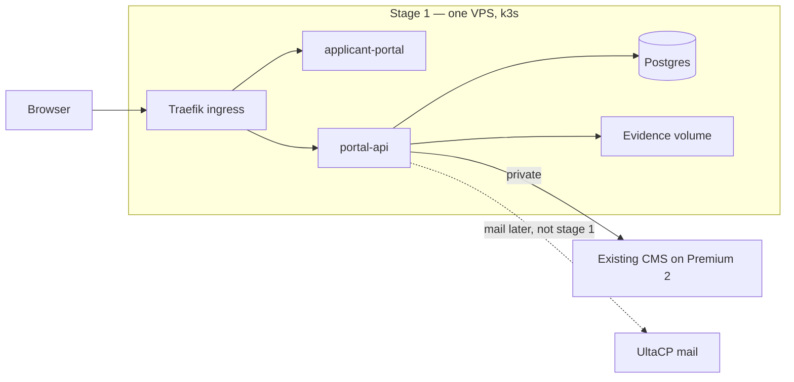

# Deployment architecture

**Document:** SDD-12  
**Status:** Working draft  
**Date:** 19 September 2026  
**Depends on:** [SDD-02](02-architecture-and-integration.md)

Logical design stays in SDD-02. This document says which repository builds which service, which machine runs it, and how a browser reaches it. The runtime is Kubernetes. The first launch stage is one node and one portal.

## 1. Hosting decision

**ADR-2 — Singapore, on UltaHost. Size follows the stage, not the largest machine already owned.**

On 19 September 2026 Aslam said the current estate is UltaHost **VDS POWER Plus × 1** and **VDS POWER Premium × 2**, and pointed at the VPS page. Region stays Singapore, the same location as the mailbox host `cp8.sgp1.ultacp.com`. The cluster does not start on a Premium. Section 2.1 is the size to provision at each stage. A larger machine already paid for may be used, but it is not the requirement.

**ADR-3 — Kubernetes, starting at the minimum.**

Application workloads run on **k3s**. k3s is the distribution because it is one binary, includes Traefik as ingress, and fits a single 16 GB node. Do not install a multi-master distribution, a service mesh, or a separate ingress product for the first stage.

The existing CMS does not move onto Kubernetes. Mail does not move onto Kubernetes.

| Machine | Plan | Spec | When it enters |
|---|---|---|---|
| Data node, stage 1–2 | VPS Professional, then Enterprise | 3 cores / 4 GB, then 4 cores / 6 GB | Stage 1. The only Kubernetes node |
| Edge node | VPS Professional | 3 cores, 4 GB, 75 GB NVMe | Stage 3. Ingress and portal pods |
| Data node, from stage 3 | POWER Plus, then Premium if full | 4 cores / 8 GB, then 8 cores / 16 GB | Stage 3. API, Postgres, files |
| System of record | POWER Premium, already owned | 8 cores, 16 GB, 450 GB NVMe | Existing CMS. Never a node |
| Mail | UltaCP `cp8.sgp1.ultacp.com` | Already provisioned | Mail only |

**Still to confirm with Aslam:** which Premium already runs the old CMS. That machine is Premium 2. If neither does, the CMS is placed there. It is still not a Kubernetes node.

## 2. Launch stages

Each stage adds workloads. It does not replace the cluster. Replicas stay at 1 until a stage says otherwise. Dates follow [SDD-03](03-delivery-milestones.md) and are still TBC.

| Stage | When | Cluster | What is running | Public names |
|---|---|---|---|---|
| 1. Minimum | Before admissions | One k3s node at the stage 1 size below | Ingress, `applicant-portal`, `portal-api`, Postgres, evidence volume. One replica each | `apply.raisd.co`, `api.raisd.co` |
| 2. Admissions launch | Milestone 2 | Same node, resized | Stage 1, wired to the real CMS. Backup CronJob. `staff-portal` only if SDD-07 has verified a gap | Same, plus `staff.raisd.co` only if that deployment exists |
| 3. Core student | Milestone 3 | Add the edge node. Data node steps up | Add `student-portal` and `lecturer-portal`. Ingress moves to the edge node | `student.raisd.co`, `teach.raisd.co`. DNS moves to the edge node |
| 4. Pilot acceptance | Milestone 4 | Same two nodes. No resize | Restore drill from the backup job. No new product in the cluster | Unchanged |
| 5. Campus expansion | Milestone 5 | Grow the data node only when it is full | Remaining portal features. Not a second control plane | Unchanged until a campus outside Southeast Asia launches |

### 2.1 Server requirements

Each row is the minimum for that stage. Do not skip ahead. Prices are the 24-month rates on ultahost.com on 19 September 2026, not a quote. All of them in Singapore.

Do not start on VPS Basic (1 GB) or VPS Business (2 GB). k3s, Traefik, Postgres, and the API need about 1 GB, 1 GB, and 0.5 GB before the operating system. 4 GB is the smallest size with headroom. The VPS line ends at 6 GB, so stage 3 is the first step onto a VDS.

| Stage | Nodes | Requirement | Smallest plan | Cluster total |
|---|---|---|---|---|
| 1. Minimum | 1 | 3 vCPU, 4 GB RAM, 75 GB NVMe | VPS Professional, about $15.87 / mo | 3 vCPU, 4 GB |
| 2. Admissions launch | 1 | 4 vCPU, 6 GB RAM, 100 GB NVMe | VPS Enterprise, about $20.69 / mo. Resize the stage 1 node. Do not add a second | 4 vCPU, 6 GB |
| 3. Core student | 2 | Edge: 3 vCPU, 4 GB, 75 GB. Data: 4 vCPU, 8 GB, 250 GB | Edge: a second VPS Professional. Data: VDS POWER Plus, about $37.72 / mo. 6 GB is no longer enough for Postgres, the API, and assignment files | 7 vCPU, 12 GB |
| 4. Pilot acceptance | 2 | Same as stage 3 | No new server | 7 vCPU, 12 GB |
| 5. Campus expansion | 2 | Edge unchanged. Data: 8 vCPU, 16 GB, 450 GB, and only when the 8 GB node is full on CPU or disk | VDS POWER Premium, about $68.43 / mo, for the data node only | 11 vCPU, 20 GB |

What is already owned, and when to use it:

- POWER Plus (4 cores, 8 GB, 250 GB) meets the stage 3 data requirement. Leave it out of the cluster until then.
- One POWER Premium meets the stage 5 data requirement, or it is the CMS. It is not the stage 1 node.
- The other POWER Premium is the CMS. It never joins Kubernetes.

Running stage 1 on the Plus box is allowed, because 8 GB is more than 4 GB. It is not the requirement. Prefer the Professional VPS so the Plus box is free for stage 3.

Stage 1 is the spec to install. Stages 2–5 are the launch sequence. Do not deploy the student, lecturer, or staff images until the stage that names them.

## 3. Repository to service

Five GitHub repositories in `raisd-campus`. The existing CMS and mail have no repository here. The control plane is one repository. Its processes are separate Kubernetes objects on the data node, not separate repositories.

| Repository | Kubernetes object | Replicas at stage 1 | Node |
|---|---|---|---|
| [`applicant-portal`](https://github.com/raisd-campus/applicant-portal) | Deployment `applicant-portal` | 1 | Data node at stage 1. Edge node from stage 3 |
| [`student-portal`](https://github.com/raisd-campus/student-portal) | Deployment `student-portal` | Not deployed | Edge node, stage 3 |
| [`lecturer-portal`](https://github.com/raisd-campus/lecturer-portal) | Deployment `lecturer-portal` | Not deployed | Edge node, stage 3 |
| [`staff-portal`](https://github.com/raisd-campus/staff-portal) | Deployment `staff-portal` | Not deployed | Edge node, stage 2 only if a CMS gap is verified, otherwise stage 3 |
| [`control-plane`](https://github.com/raisd-campus/control-plane) | Deployment `portal-api` | 1 | Data node |
| [`control-plane`](https://github.com/raisd-campus/control-plane) | StatefulSet `postgres` | 1 | Data node |
| [`control-plane`](https://github.com/raisd-campus/control-plane) | PersistentVolumeClaim `evidence` | 1 volume | Data node |

One namespace, `campus`. All Services are ClusterIP. Only the ingress is reachable from outside the cluster.

Portal pods do not open Postgres and do not call the CMS. They call `portal-api`.

## 4. How the services call each other

From stage 3 the ingress and the portal Deployments run on the edge node. `portal-api`, Postgres, and the evidence volume stay on the data node by node selector. The arrows do not change.

Rules:

1. A portal pod never talks to Postgres, the evidence volume, or the CMS.
2. `portal-api` reports success only after the CMS acknowledges the write.
3. Postgres and the evidence volume have no Ingress and no host port.
4. Premium 2 is not a cluster node. It accepts CMS traffic from `portal-api` only.
5. Mail is not in the request path. Webmail stays on UltaCP.

## 5. How they are exposed

Traefik, installed with k3s, terminates TLS and routes by hostname. There is no Caddy and no Docker Compose.

Stage 1 and 2: public DNS points at the **single data node**. Stage 3 onward: public DNS points at the **edge node**, and the data node no longer accepts 443 from the internet.

| Public name | Repository | First served | Who |
|---|---|---|---|
| `apply.raisd.co` | `applicant-portal` | Stage 1 | Applicants |
| `api.raisd.co` | `control-plane` | Stage 1 | Portal browsers, with a bearer token |
| `staff.raisd.co` | `staff-portal` | Stage 2 if a gap is verified, otherwise not until stage 3 | Registry, Faculty, Bursary, QA, Marketing |
| `student.raisd.co` | `student-portal` | Stage 3 | Students |
| `teach.raisd.co` | `lecturer-portal` | Stage 3 | Lecturers |

`raisd.co` comes from the mailbox domain. These names are not a DNS change that has already been made. Do not publish a name before its Deployment exists.

Separate hostnames are deliberate. The API issues a bearer token. Do not set a cookie on `Domain=.raisd.co`.

The existing CMS keeps its current URL. It is not an Ingress rule. Webmail stays at `https://cp8.sgp1.ultacp.com:2096/`.

### Firewall

| Machine | Stage 1–2 | From stage 3 |
|---|---|---|
| Data node | 443 and 80 from the internet. 80 redirects to 443 | No public 443. Cluster traffic from the edge node only |
| Edge node | Does not exist yet | 443 and 80 from the internet |
| CMS host | Existing CMS URL only, if staff already use it. CMS port from the data node | Same |
| UltaCP | 2096 and mail ports, as today | Same |

Postgres has no host port. SSH is for operators.

## 6. One admissions request

This is the stage 1 path. The hostname does not change in later stages. Only the node that owns 443 changes.

1. The browser loads `https://apply.raisd.co`. Traefik sends it to the `applicant-portal` Service.
2. The browser calls `https://api.raisd.co` with the applicant token. Traefik sends it to `portal-api`. The browser never sees a pod address.
3. `portal-api` checks role and campus, writes the file to the evidence volume, and writes the application to the CMS on Premium 2.
4. If the CMS does not acknowledge, the API returns a failed save.
5. Registry reviews in the existing CMS. `staff.raisd.co` is not part of stage 1.

## 7. What is installed on the first node

The stage 1 node, and nothing else:

- Ubuntu 24.04 on the VPS Professional (3 vCPU, 4 GB, 75 GB)
- k3s, single server, Traefik enabled, no extra registries
- Namespace `campus`
- The four objects in the stage 1 column above
- Local persistent volumes on the NVMe disk
- A CronJob is **not** in stage 1. The backup job arrives at stage 2, before admissions is called Live

No Helm catalogue beyond what k3s ships. No Prometheus, no cert-manager add-on until Traefik's built-in TLS is not enough, no second control plane.

## 8. What this does not include

- A server larger than the row in section 2.1. The two Premiums are not the stage 1 cluster.
- VPS Basic or VPS Business. 2 GB is below the floor.
- Putting the CMS or mail on Kubernetes.
- Deploying student, lecturer, and staff portals in the minimum install.
- High availability, a service mesh, or more than one replica, before stage 5 shows the node is full.

## 9. Related documents

- Logical architecture and [CAP-53](11-capability-catalog.md#cap-53): [SDD-02](02-architecture-and-integration.md)
- Milestone order these stages follow: [SDD-03](03-delivery-milestones.md)
- Staff screens only for verified CMS gaps: [SDD-07](07-admin-staff-cms.md)
- Environments and security baseline: [SDD-08](08-shared-platform.md)
