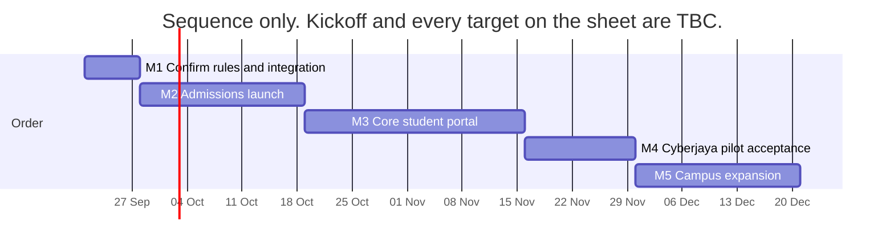
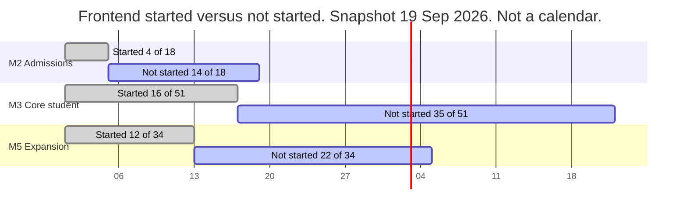

# Progress, timeline, and remaining work

**Document:** SDD-13  
**Status:** Working draft  
**Date:** 19 September 2026  
**Source:** [Student Portal and CMS Daily Checklist](https://docs.google.com/spreadsheets/d/1Yux9R8hIgcPrQ5OklKd9Oyq_04qJtaAhcxJvr_7NvYI/edit?usp=sharing), downloaded 19 September 2026. Faid Zamin shared that sheet in the working-group chat on 18 September 2026 and said the student portal v1 frontend was still being built.

Local copy: [materials/docs/working-group/](../../materials/docs/working-group/SOURCE.md).

## 1. What changed in the latest sheet

Status cells did not move. The download has the same 112 detailed rows, the same Frontend / Mobile / Backend values, and the same TBC owners and target weeks as the 18 September copy.

The only newer timestamp is [CAP-35](11-capability-catalog.md#cap-35) on the student portal (accessibility), last updated 9 September 2026. Its status is still Demo. Every other detailed row was last touched 7 September 2026.

The chat after the 18 September meeting records that the meeting ended. It does not record a new date, a new owner, or a status change.

**Completion, using the sheet's own word:** a row is complete only when it is **Live**. Live count is **0**. Demo, Partial, and Placeholder are not completions. The simplified tab's "Frontend ready" (23 grouped rows) is the same work the detailed tab calls Demo or Partial.

## 2. Milestone progress

Applicable rows exclude Frontend = Not applicable. "Started" means Demo, Partial, or Placeholder. Backend is Needs checking on every applicable row, including the ones with a started frontend.

| Milestone | Rows | Applicable | Started | Not started | Live |
|---|---:|---:|---:|---:|---:|
| 1. Confirm rules and integration | 1 | 0 | 0 | 0 | 0 |
| 2. Admissions launch | 23 | 18 | 4 | 14 | 0 |
| 3. Core student portal | 51 | 51 | 16 | 35 | 0 |
| 4. Cyberjaya pilot acceptance | 1 | 0 | 0 | 0 | 0 |
| 5. Campus expansion and remaining CMS | 36 | 34 | 12 | 22 | 0 |

By portal, detailed tab:

| Portal | Started | Not started | Live |
|---|---:|---:|---:|
| Applicant | 0 of 7 | 7 | 0 |
| Student | 31 of 40 | 9 | 0 |
| Lecturer | 0 of 18 | 18 | 0 |
| Admin / staff | 0 of 37 | 37 | 0 |
| Shared system | 1 ([CAP-53](11-capability-catalog.md#cap-53), Partial) | 0 applicable frontend | 0 |

The student UI is ahead of the sequence. Product priority on the Timeline tab is still admissions before the core student portal. Four admissions rows have a student-side frontend start (sign-in Placeholder, accessibility Demo, privacy Partial, and the mobile shell is Not applicable). The applicant and staff halves of admissions are not started.

## 3. Timeline

From the Timeline tab, fetched 19 September 2026. Kickoff is TBC. Backend commitment is TBC. Every milestone target is TBC. There is no agreed week to put on a calendar.

| Order | Milestone | Target | Release condition, shortened |
|---|---|---|---|
| 1 | Confirm rules and integration | TBC | Rules, API access, and operating responsibilities agreed |
| 2 | Admissions launch | TBC | Application to enrolment works on real records |
| 3 | Core student portal | TBC | Student and staff journeys work with durable records |
| 4 | Cyberjaya pilot acceptance | TBC | Campus accepts the pilot |
| 5 | Campus expansion and remaining CMS | TBC | Each campus accepts its rollout |

The bars below are the order only. Their length is not a duration the group has agreed. Do not read the dates as a plan.

## 4. Gantt of progress

Each bar is the share of applicable rows, not time. Filled means the frontend has been started. Nothing in the filled part is Live.

[M1](03-delivery-milestones.md#m1) and [M4](03-delivery-milestones.md#m4) have no frontend rows. They are still open: rules and owners are TBC, and Cyberjaya has not accepted a pilot.

## 5. Tasks still to do

### Before any milestone can be called Live

- Name the next-action owner on each row. All 112 are TBC.
- Agree a target week. All 112 are TBC.
- Agree kickoff and the backend commitment on the Timeline tab. Both are TBC.
- Move backend off Needs checking. That is every applicable row.

### [M1](03-delivery-milestones.md#m1) — confirm rules and integration

- [CAP-42](11-capability-catalog.md#cap-42). Copyright and provider approvals. Non-software. Not started as an operating check.

### [M2](03-delivery-milestones.md#m2) — admissions launch

These are the tasks on the critical path. Applicant and staff rows are Not started. Student rows listed here are not Live.

| ID | Surface | Task | Frontend now |
|---|---|---|---|
| [CAP-02](11-capability-catalog.md#cap-02) | Applicant | Online application form | Not started |
| [CAP-03](11-capability-catalog.md#cap-03) | Applicant | Upload documents and English-entry evidence | Not started |
| [CAP-07](11-capability-catalog.md#cap-07) | Applicant | Track, view offer, accept enrolment | Not started |
| [CAP-55](11-capability-catalog.md#cap-55) | Applicant | Policies and declarations | Not started |
| [CAP-16](11-capability-catalog.md#cap-16) | Applicant | Announcements. Marketing does not issue offers | Not started |
| [CAP-01](11-capability-catalog.md#cap-01) | Applicant | Sign-in and account | Not started |
| [CAP-35](11-capability-catalog.md#cap-35) | Applicant | Accessible forms | Not started |
| [CAP-36](11-capability-catalog.md#cap-36) | Applicant | Mobile registration shell | Not started |
| [CAP-03](11-capability-catalog.md#cap-03), 05, 06, 07 | Staff | Review evidence, qualifications, foreign awards, offer, first enrolment | Not started |
| [CAP-04](11-capability-catalog.md#cap-04) | Staff | Record programme and site approvals before taking applications | Not started |
| [CAP-16](11-capability-catalog.md#cap-16) | Staff | Recruitment copy only | Not started |
| [CAP-44](11-capability-catalog.md#cap-44) | Staff | Confirm old-CMS staff access. New screens only for a verified gap | Not started |
| [CAP-01](11-capability-catalog.md#cap-01) | Student | Real sign-in and logout. Today's control is a placeholder | Placeholder |
| [CAP-35](11-capability-catalog.md#cap-35) | Student | Accessibility audit. Last sheet edit, still Demo | Demo |
| [CAP-39](11-capability-catalog.md#cap-39) | Student | Server-enforced privacy | Partial |
| [CAP-53](11-capability-catalog.md#cap-53) | Shared | Portal API to the existing CMS. Partial. This gates the milestone | Partial |
| [CAP-37](11-capability-catalog.md#cap-37), 38, 39 | Shared | Monitoring, backups, security. Not screens | Not started as operations |

### [M3](03-delivery-milestones.md#m3) — core student portal

16 of 51 rows have a student frontend start. 35 are not started, including every lecturer row and the staff path for the same capabilities. A student Demo does not close the row. Lecturer publish, attendance, and marking, and the staff approval path, are still to do. See [SDD-11](11-capability-catalog.md).

### [M4](03-delivery-milestones.md#m4) — Cyberjaya acceptance

[CAP-41](11-capability-catalog.md#cap-41) staff training and operating readiness. Not a screen. Not started.

### [M5](03-delivery-milestones.md#m5) — campus expansion

22 of 34 applicable rows are not started. Includes quizzes, live class, library, visa, housing, scholarships, and online payment. Do not pull these forward of admissions.

## 6. Related documents

- Milestone definitions: [SDD-03](03-delivery-milestones.md)
- Full rows: [SDD-11](11-capability-catalog.md)
- Sheet: [working-group source](../../materials/docs/working-group/SOURCE.md)
